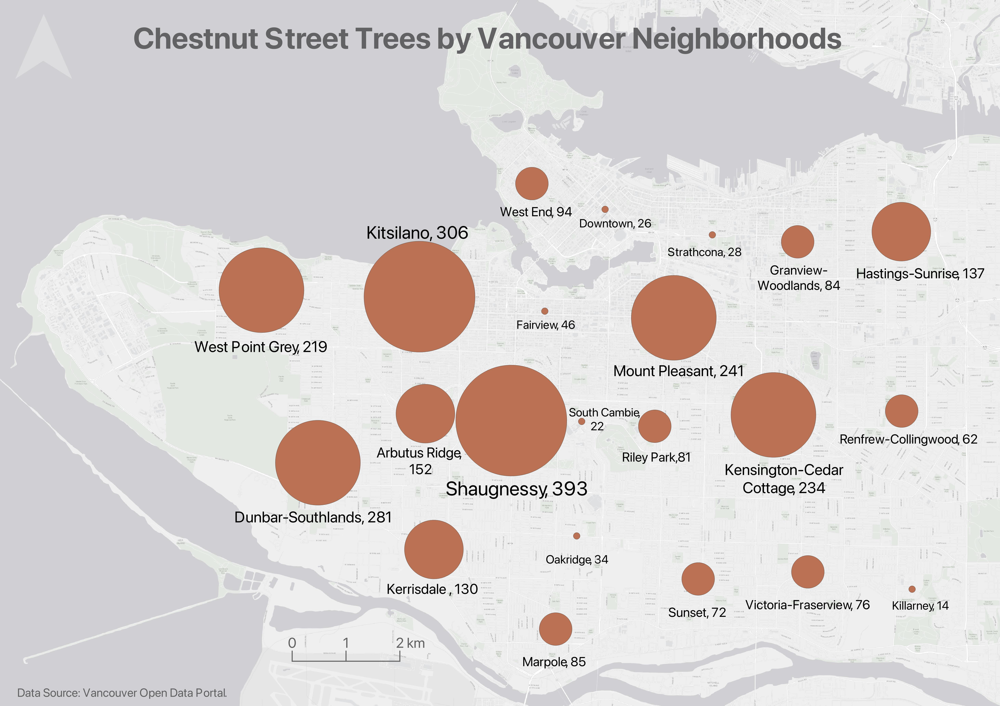
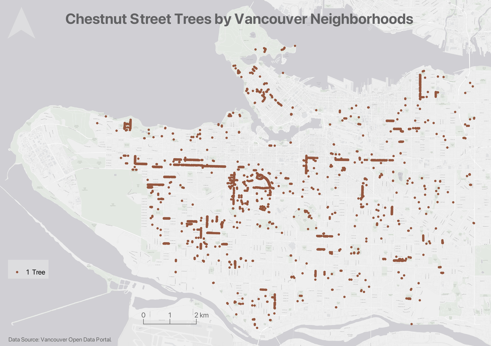
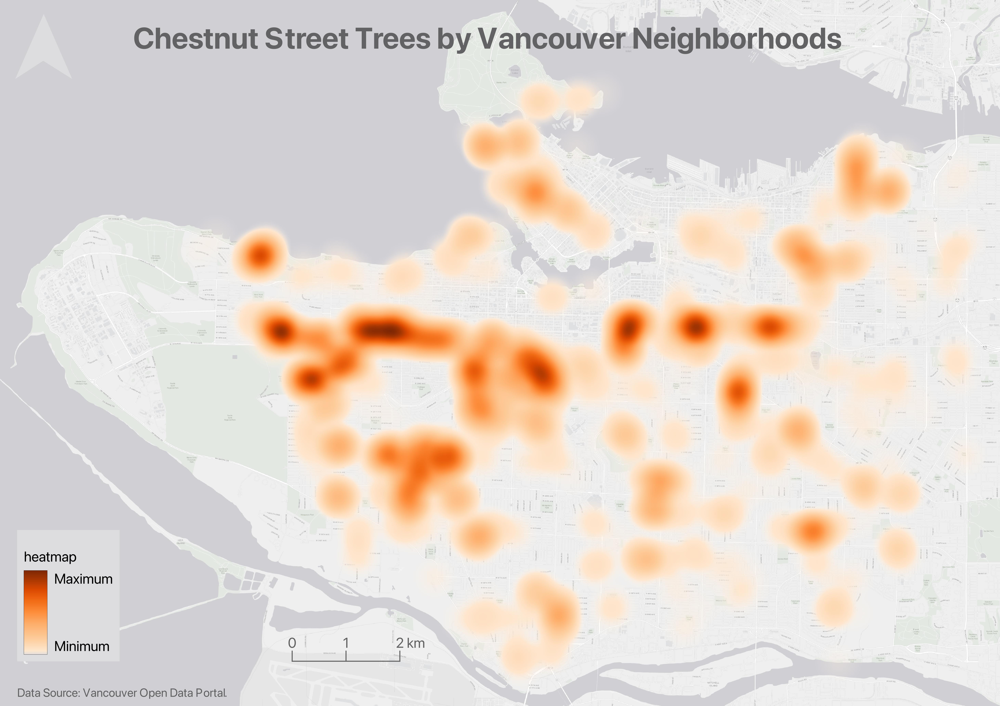

# Thematic Maps

As you learned in the <a href="https://ubc-library-rc.github.io/gis-mapping-intro/" target="_blank">Intro to Mapmaking with QGIS</a>, there are two main kinds of maps: **reference maps** and **thematic maps**. While reference maps are contextual, providing a 'lay of the land' as it were, thematic maps visualize the results of some kind of spatial analysis.
<!-- 
 Spatial analysis involves xyz to answer spatial questions, and is generally carried out inside a Geographic Information System. A Geographic Information System, or GIS, enables you to analyze and manipulate spatial data inside a graphical user interface.  -->

 Writes Statistics Canada: “A thematic map shows the spatial distribution of one or more specific data themes for standard geographic areas.” Thematic maps render the results of spatial anlaysis. [QGIS](https://docs.qgis.org/2.18/en/docs/gentle_gis_introduction/spatial_analysis_interpolation.html#:~:text=Overview,Geographic%20Information%20System%20(GIS).){:target="_blank"} defines **spatial analysis** as:

> the process of manipulating spatial information to extract new information and meaning from the original data. Usually spatial analysis is carried out with a Geographic Information System (GIS). A GIS usually provides spatial analysis tools for calculating feature statistics and carrying out geoprocessing activities such as data interpolation.

Below are examples of different thematic maps, all visualizing chestnut street trees by Vancouver neighborhoods. 

## Choropleth maps
Choropleth maps are useful to visualize and compare the density, frequency, or quantity of a value generalized across standardized geographic areas (such as zip-codes, provinces, or countries). See [Axis Map's guide to choropleth maps](https://www.axismaps.com/guide/choropleth){:target="_blank"} for more. Unless you specifically want to emphasize differences in total number of events/data points, it is best practice to normalize your data when choropleth mapping. Normalization is when you divide the values for each geographic area by something like the area in square kilometers or total population of that area. For instance, mapping winter flu cases across census tracts in British Columbia, you’d want to normalize the total cases in each census tract by that tract’s total population. Normalization enables better comparison across multiple geographic areas. See [Axis Maps](https://www.axismaps.com/guide/standardizing-data){:target="_blank"} for more. 

The map below shows total chestnut street trees per Vancouver neighborhood. 

The map below shows chestnut street trees as a fraction of total street trees per Vancouver neighborhood. 

Each map serves a purpose. It's simply important to consider what information you want to convey with your map. 

## Proportional Symbol maps
Choropleth maps use a color gradient to convey value differentials, whereas proportional symbol maps use symbol size. Proportional symbol maps are useful to visualize the quantity of something across respective locations. Proportional symbols are quite intuitive, and can be combined with other parameters like color and lettering size to provide rich spatial information. Proportional symbols can even be layered atop a choropleth map. See [Axis Map's guide to Proportional Symbols](https://www.axismaps.com/guide/proportional-symbols){:target="_blank"} or [School of Cities](https://schoolofcities.github.io/urban-data-storytelling/urban-data-visualization/proportional-symbol-maps/proportional-symbol-maps.html){:target="_blank"} for more.

In most cases you do not normalize values when using proportional symbols, as that would reduce the range in difference. If anything, it can be useful to exaggerate the range slightly. While Absolute Scaling renders symbols increasingly larger along a linear scale, Perceptual/Apparent Scaling compensates for the eye’s tendency to reduce difference in sizes close together. See [here](https://makingmaps.net/2007/08/28/perceptual-scaling-of-map-symbols/){:target="_blank"} for more. 

## Dot Density maps
Dot density maps are useful in visualizing the concentration and distribution of discrete incidents. Each dot can represent an event (e.g., an earthquake), or a multiple such as 10. Dot Density maps can over-simplify. See [Axis Map's guide to Dot Density Maps](https://www.axismaps.com/guide/dot-density){:target="_blank"} for more.

## Heatmaps
Heatmaps are useful in visualizing the intensity or frequency of occurrence. Heatmaps can be thought about as generalized dot density maps.

## Cartograms 
Cartograms distort area to emphasize the value associated with a geographic region. When using cartograms, it’s important to consider whether your audience is already familiar with the un-distorted geography, otherwise they might not glean the added information.

There is a case to be made that all maps are thematic, as the definition of boundaries, borders, names, etc. is a political - and almost always contested - act. In other words, there are no neutral maps that simply, impartially, represent an objective reality or truth. See [Crampton and Krygier (2006)](https://acme-journal.org/index.php/acme/article/view/723){:target="_blank"} or [Harley (1992)](https://quod.lib.umich.edu/p/passages/4761530.0003.008/--deconstructing-the-map?rgn=main;view=fulltext){:target="_blank"} for a seminal introduction to critical cartography, or [Wang and Liu (2022)](https://www.researchgate.net/publication/365011390_Maps_and_cartography_Progress_in_international_critical_cartographyGIS_research){:target="_blank"} for an overview of critical cartography and GIS through the last several decades. See also the classic by Denis Wood, The Power of Maps. For an excellent read on the power of Google Maps, see [Digital territories: Google maps as a political technique in the re-making of urban informality](https://journals.sagepub.com/doi/10.1177/0263775818766069){:target="_blank"}.
{: .note}

 

### Static or dynamic?
{: .no_toc}
While outside the remit of this workshop, may be important to you is whether your map is static or dynamic. Both reference maps and thematic maps can be either static or dynamic. Static maps tell a spatial story at a single scale. Static maps can be exported/stored/formatted as an image (.jpeg or .png), can be exported as a pdf, printed or embedded digitally into website or online publication. They can also be included in an academic paper, poster, or flyer. Dynamic maps, on the other hand, allow the user to interact with your spatial story. Dynamic display data in an interactive fashion, allowing viewers to pan around and zoom in and out to reveal more information at different scales. This workshop focuses on static reference maps. For more on making web maps, please see our [Research Commons Workshop on Webmapping](https://ubc-library-rc.github.io/gis-webmapping/){:target="_blank"}. 

  

----
#### Resources for Thematic Mapping
- [Axis Map's Guide](https://www.axismaps.com/guide){:target="_blank"}
- [ColorBrewer](https://colorbrewer2.org/#type=sequential&scheme=BuGn&n=3){:target="_blank"} is a fantastic resource for generating customized color palettes. 
- [Coloring for Colorblindness](https://davidmathlogic.com/colorblind/#%23D81B60-%231E88E5-%23FFC107-%23004D40){:target="_blank"} for colorblind-friendly palettes.
- [Axis Map's guide to Choropleth Maps](https://www.axismaps.com/guide/choropleth){:target="_blank"}
- [Axis Map's guide to Proportional Symbols](https://www.axismaps.com/guide/proportional-symbols){:target="_blank"}
- [Axis Map's guide to Dot Density Maps](https://www.axismaps.com/guide/dot-density){:target="_blank"}
- [Axis Map's guide to Cartograms](https://www.axismaps.com/guide/cartograms){:target="_blank"}
- Axis Map's guide to [Univariate vs Multivariate Maps](https://www.axismaps.com/guide/multivariate-vs-univariate){:target="_blank"}
- [Perceptual Scaling of Map Symbols](https://makingmaps.net/2007/08/28/perceptual-scaling-of-map-symbols/){:target="_blank"} by John Krygier.
- Another UBC Research Common's [tutorial on Proportional Symbol Mapping](https://ubc-library-rc.github.io/gis-reference-mapping/content/hands-on12.html){:target="_blank"}, including guide to sizing proportional symbols by hand in an illustration software.
- [Axis Map's guide to Data Classification](https://www.axismaps.com/guide/data-classification){:target="_blank"}
- UBC Research Commons tutorial on making [Heatmaps with QGIS](https://ubc-library-rc.github.io/gis-reference-mapping/content/hands-on13.html){:target="_blank"}
- UBC Research Commons tutorial on making [Cartograms with QGIS](https://ubc-library-rc.github.io/gis-reference-mapping/content/hands-on14.html){:target="_blank"}

