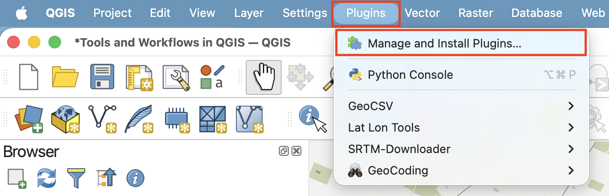
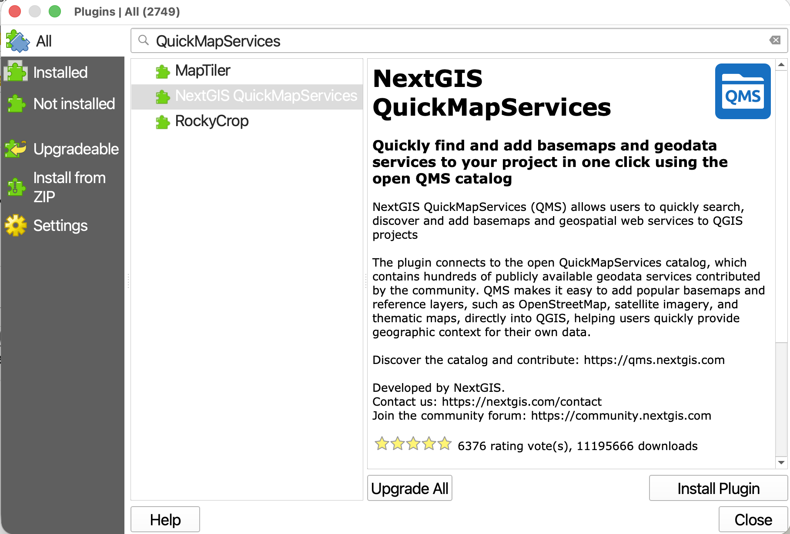
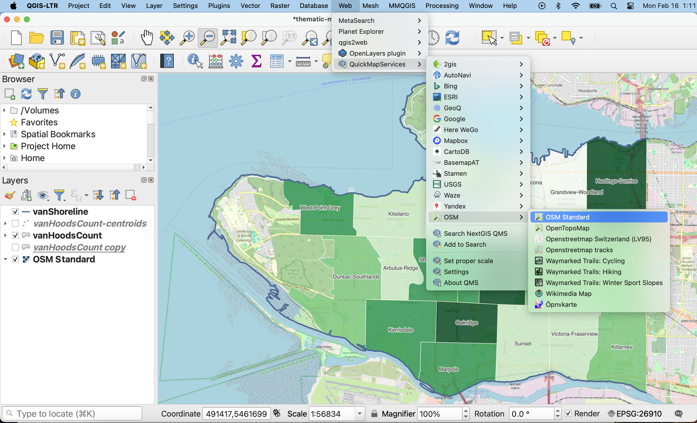
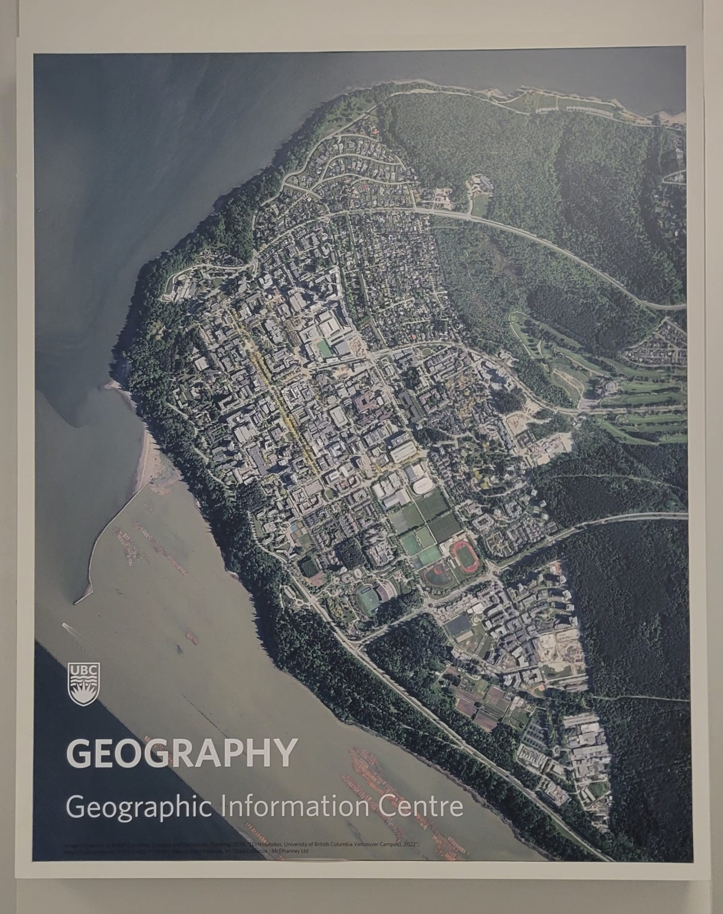

# Add a Basemap

***Save and close your print layout, and return to the main QGIS interface***

A **basemap** is helpful to give spatial context to your data layers—both as you're working and in your final map. You can also create a reference map that is simply a basemap. For example, the map made over the course of this workshop used Natural Earth data to show the countries surrounding Canada. Another way to add geographic context is through a web-based basemap. Web-based basemaps are maps of the whole world that are stored on servers and which you can add to your project without downloading them to your local computer. The following page will guide you through adding web-based basemaps to your QGIS project. 
 

## Adding basemaps from web plugin
{: .no_toc}

While your out-of-the-box QGIS applicaiton will have a few basemap options under the XYZ tab of your Browser Panel, you can access way more with a plugin. [QGIS Plugins](https://plugins.qgis.org/){:target="_blank"} are user developed tools that extend QGIS functionality beyond the basics. There are two popular plugins for webmap libraries called QuickMapServices and OpenLayers. The following documentation will show you how to install the QuickMapServices plugin, add basemaps to your QGIS project, and create and export a map using one of them. 

### 1. Install Plugin
{: .no_toc}
[QGIS plugins](https://plugins.qgis.org/){:target="_blank"} are user developed tools that extend QGIS functionality beyond the basics. To access basemaps, we'll first install the QuickMapServices plugin. Click on the **Plugin** menu at the top of your screen and select **Manage and Install Plugins...**

In the dialogue box that opens, select **All** as a search category on the left and type "QuickMapServices" as one word. Install the NextGIS plugin and close the dialogue box.

### 2. Load Basemap
{: .no_toc}

Now go to the **Web** menu at the top of your screen. You should see the QuickMapServices plugin. You will see an array of basemap options. Select OpenStreetMap as your basemap. Like QGIS, [Open Street Map (OSM)](https://www.openstreetmap.org/about){:target="_blank"} is open source and user developed. Make sure to drag your basemap to the bottom in your Layers Panel.

> * Use the zoom tools located in the toolbar to zoom to see each basemap in detail. 
> * Hide a basemap at any time by unchecking the box beside it in the Layers panel. 
> * Remove a basemap at anytime by right clicking the layer and selecting “remove.”
> * Sometimes when you re-open a QGIS project basemaps previously loaded will turn up blank. Try right-clicking the basemap in your Layers Panel and zooming to it. Otherwise, simply re-add the basemap from the Web menu at the top of your screen.

Explore adding other basemaps as well. For instance, **Esri's satellite imagery map** is neat. 
 
Note that sometimes when you re-open a QGIS project basemaps previously loaded will turn up blank. Try right-clicking the basemap in your Layers Panel and zooming to it. Otherwise, simply re-add the basemap from the Web menu at the top of your screen.

If you cannot find the plugin "Next GIS Quick Map Services" only "Quick Map Services" or there appear not to be as many basemap options, you may be working on a prior version of QGIS. That's okay! Refer to [this page](https://ubc-library-rc.github.io/gis-reference-mapping/content/hands-on6.html){:target="_blank"} for documentation on how to add basemaps that matches your QGIS version. 
{: .note}

### Making a map from a basemap
{: .no_toc}

To use a basemap as your final reference map, simply turn off or remove all other layers. Create a new Print Layout and add your map. Be sure to include a source statement at the bottom. Be sure to check the license of any basemap before using it for academic publication. 

