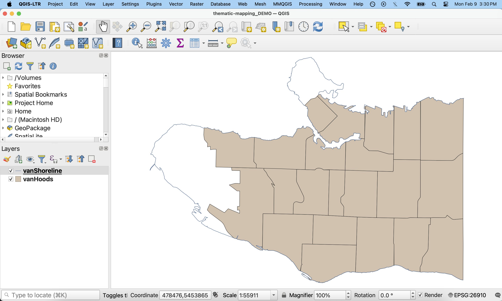

# Hands On Thematic Mapping
In this section, you will create two thematic maps — a choropleth map and a proportional symbol map — to visualize the number of douglas fir street trees in each Vancouver neighbourhood. Through making these maps, you will learn how to build queries that run selections on your data, as well as analyze the spatial distribution of your data by running geoprocessing tools. 

## Open the QGIS Project 
First things first, be sure you've downloaded *and unzipped* the workshop data folder. Download it to a folder on your physical computer, such as Desktop or Downloads, _not_ OneDrive.

[Download Workshop Data](../thematic-mapping-workshop.zip){: .btn .btn-blue }

Inside the `thematic-mapping-workshop` folder you will see the following:

- a `data` subfolder, containing data from the [Vancouver Open Data Portal](https://opendata.vancouver.ca/pages/home/), and 

- a `thematic-mapping.qgz` QGIS project.

To Do
{: .label .label-green }
Double click `thematic-mapping.qgz` to open the project in QGIS. Once open, Zoom to `vanShoreline`. Your map canvas will look like this: 

 

### A note on data 
For this workshop, we will begin with a pre-made project that contains 'clean' data that is organized into folders. The project file, `thematic-mapping.qgz`, already contains the file paths to two layers: `vanShoreline` and `vanHoods`. `vanShoreline` is a shapefile of the coastal outline of the City of Vancouver, and `vanHoods` is a shapefile of the city's neighbourhoods, or '[Local Area Boundaries](https://opendata.vancouver.ca/explore/dataset/local-area-boundary/information/?disjunctive.name)'. The `data` subfolder also contains `vanBigTrees` a geojson file containing a subset of [Vancouver Street Trees](https://opendata.vancouver.ca/explore/dataset/public-trees/map/?disjunctive.common_name&disjunctive.species_name&location=12,49.24773,-123.08842&basemap=jawg.streets). The source data of this subset contains over 180,000 features and is 72MB. 
When mapping independently, you will likely begin by searching for and evaluating datasets on your own. This can be a time consuming (and potentially expensive!) step. It’s also common to have to clean, transform, or otherwise process your data in order for it to work correctly in your GIS project. We are avoiding this by design by providing a prepared QGIS project and pre-processed data for this workshop.

Remember, unlike in ArcGIS Pro, a QGIS project does not store your data but rather the file path connections; if you ever move your data to a different storage location, QGIS will prompt you to update the location of the layer in the Layers Panel. Best practice is to keep your data organized in folders associated with your project so that they are logically arranged in folder systems from the very start of any project. A QGIS project also contains any style settings that have been applied to your data layers. Remember to save often to protect your work!

<!-- It is important that you keep the paths to your data layers intact to avoid broken links. -->

