# The **Attribute Table**
The **Attribute Table** is where you can view the tabular data associated with vector datasets. Here, you can query your data by running complex selections, directly edit individual features, and perform mathematical operations on your layers. See the <a href="https://docs.qgis.org/3.40/en/docs/user_manual/working_with_vector/attribute_table.html" target="_blank">QGIS documentation on working with the attribute table</a> for more.

----

## Exploring the Attribute Table 

<!-- To Do
{: .label .label-green } -->

*1*{: .circle .circle-yellow} Add `vanBigTrees` to your map canvas. This is a geojson file containing a subset of [Vancouver Street Trees](https://opendata.vancouver.ca/explore/dataset/public-trees/map/?disjunctive.common_name&disjunctive.species_name&location=12,49.24773,-123.08842&basemap=jawg.streets). The reason it is only a subset is because the original dataset contains over 180,000 features and is 72MB — too large to work with in today's workshop. 

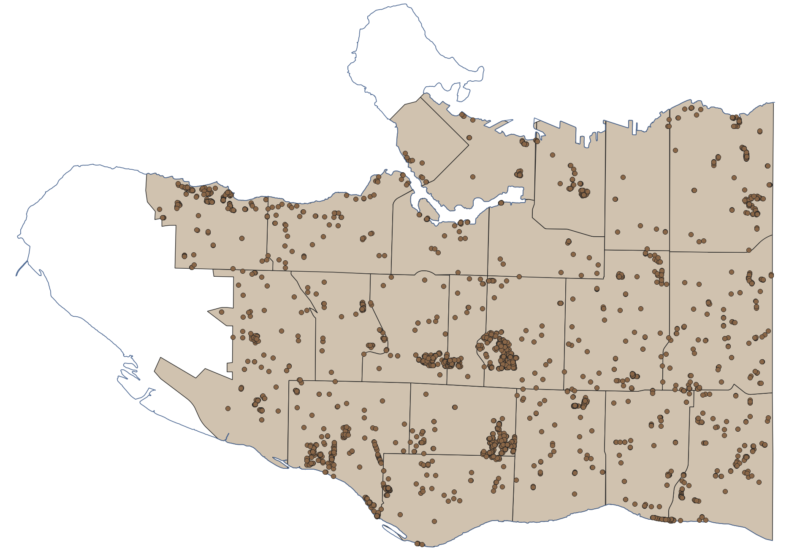

<!-- To Do
{: .label .label-green } -->

 

*2*{: .circle .circle-yellow} Now, open the **Attribute Table** for `vanBigTrees`. 

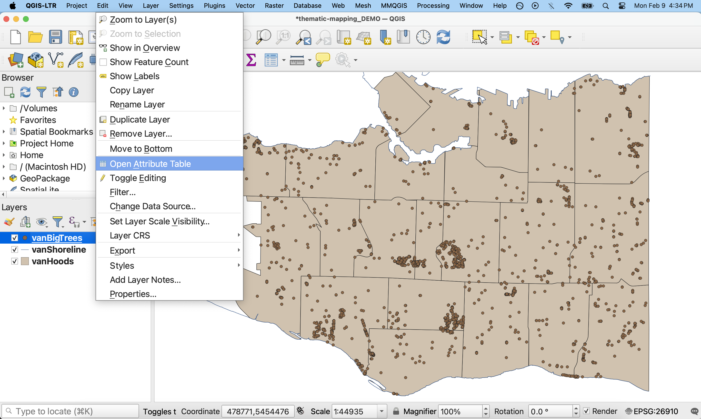

 

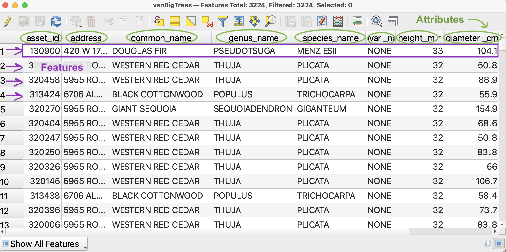

 The column headings are called **Attributes**. Each column is called a **Field** and each row is called a **Feature**. Each feature corresponds to one point on your map. (If you were looking at the attribute table of `vanHoods`, each feature would correspond to a polygon, and so on.) At the top of the Attribute Table you can see there are 3,224 features, or trees, in this dataset. Each feature, or tree, has 10 attributes, including the `common_name` and `height_m`. Notice that text values are left-justified whereas numerical values are right-justified. Sometimes cell values will be `NULL` meaning the feature contains no information for a given value. For instance, very few trees have information for the data planted. 

 <!-- Notice that text values are left-justified whereas numerical values are right-justified. Sometimes QGIS will read numbers as text, disabling mathematical operations. If this happens, you will have to create a new field and set the type to either integer or decimal.  -->

 
*3*{: .circle .circle-yellow} You can order Features in descending or ascending order by clicking on the attribute. 
- Click `height_m` to sort all Features from shortest to tallest. Click `height_m` again to sort from tallest to shortest. (Notice some of the shortest trees were planted just last month.) 
- Click `common_name` to sort the trees in alphabetical order. 

<!-- *4*{: .circle .circle-yellow}
Form and Table view.  -->

 

## Selecting by Attribute
Selections are different than using the **Identify tool** to highlight a feature and expose its attributes. Selections select a set of features in the Attribute Table. Once attributes are thus selected, you can edit them, export them, or perform more analysis. 

There are many ways to make selections in QGIS. 
- You may **manually select** features from the map canvas using the **Selection Toolbar** 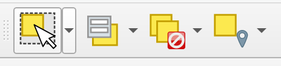;
- You may **select features by location** using the **Select by location** vector analysis tool; 
- And you can **select features by attribute** within the Attribute Table. 

Remember, our goal is to discover how many Douglas Fir street trees there in each neighbourhood and then visualize the respective totals through a thematic map. So, we are not interested in *all* big trees, only in Douglas Firs. This means we need to run a selection. We will build an expression that **selects by attribute** only those features where the common name is equal to Douglas Fir. 

### Select only the Douglas Fir trees
*1*{: .circle .circle-yellow} From the Attribute Table of `vanBigTrees`, click on the **Select features using an expression** button.

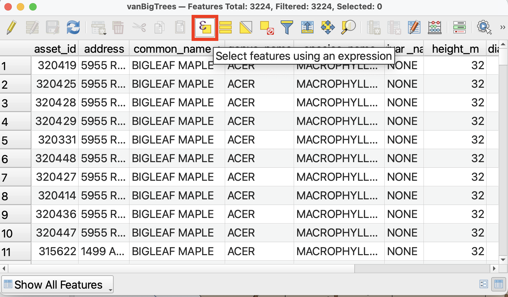

We will use this tool to query and select only features where the`common_name` is “Douglas Fir”. Rather than writing an expression by hand, we will select the appropriate fields, values, and operators from the drop-downs provided. This ensures no syntax errors are made and our selection runs smoothly. 

 
*2*{: .circle .circle-yellow} From the middle panel, expand **Fields and Values**. Double click on `common_name` to add it to the Expression builder. 

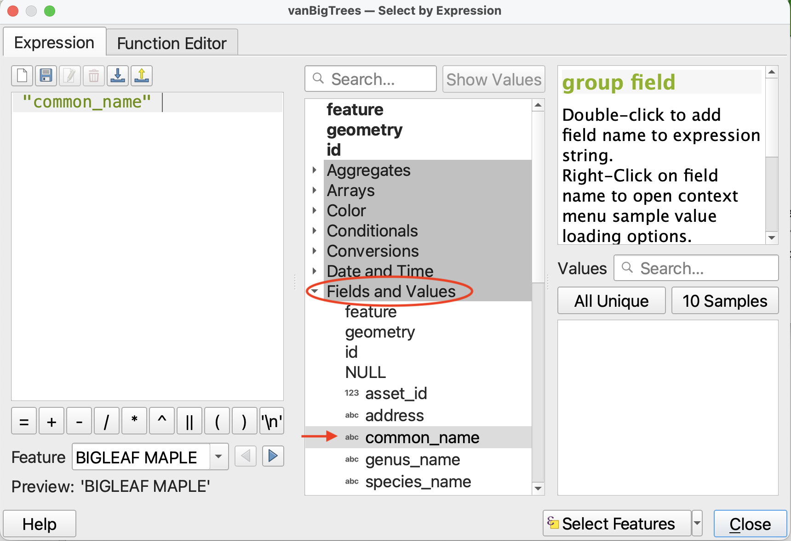

 
*3*{: .circle .circle-yellow} Then click the `=` operator. You will get a warning saying your expression is invalid. That's okay! We aren't finished building it.

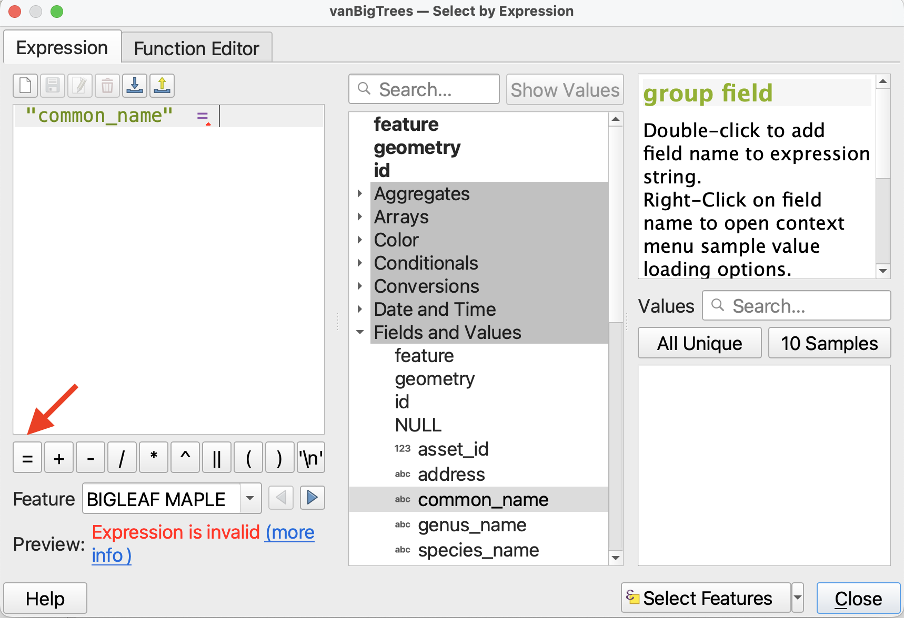

 
*4*{: .circle .circle-yellow} Finally, we need to indicate what the common name is equal to. In the right-hand panel, click the button for **All Unique** to display all the unique values for common name in the dataset. Double-click on "Douglas Fir" to add it to the expression. Your expression should now be `"common_name" = 'DOUGLAS FIR'`. 

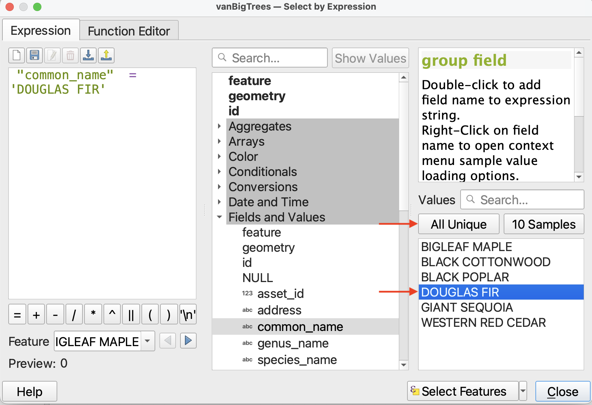

 
*5*{: .circle .circle-yellow} Now click **Select Features** on the bottom-right. Close the expression builder and return to the Attribute table. You will see that 2,396 features have been selected. Selected features will be highlighted in the Attribute Table. If you the Attribute Table indicates a selection was made but you don't see any highlighted features, try ordering the Attribute Table by `common_name`, and then scrolling down to the letter "D". 

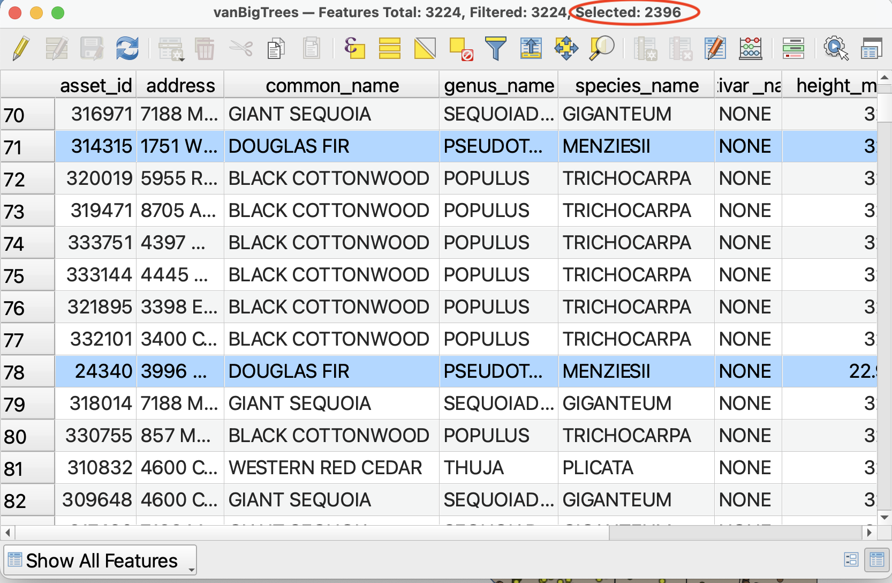

Alternatively, you can change the Attribute Table view to view *only selected features*. Just be sure to change the view back afterwords, or next time you open the attribute table it will appear empty if no selections have been made. 

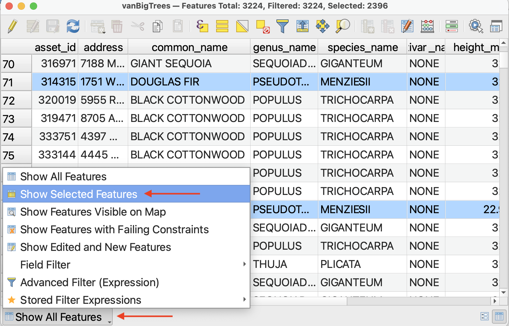

 
*6*{: .circle .circle-yellow} Now close the Attribute Table and return to the main QGIS interface. In the Map View, you should see your selection highlighted. These are all the Douglas Fir street trees in Vancouver.

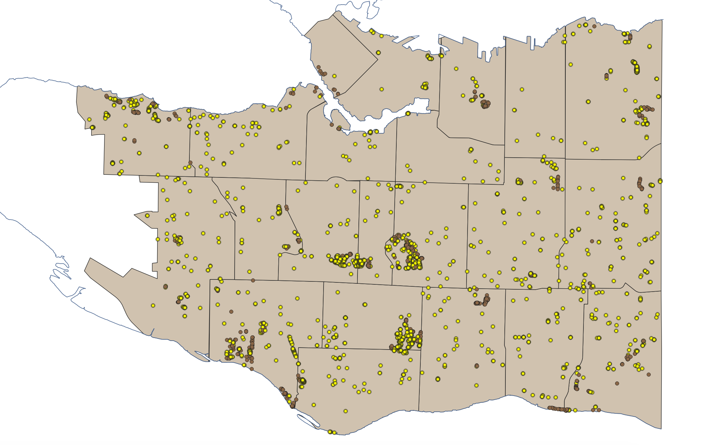

## Exporting selections as a new dataset

We need to create a dataset that is just Douglas Firs. To do this, we can "export" our selection as a new dataset. 

*1*{: .circle .circle-yellow} Right-click on the layer `vanBigTrees` in the Layers Panel. Choose **Export** and then be sure to choose **Save *selected* Features As**. 

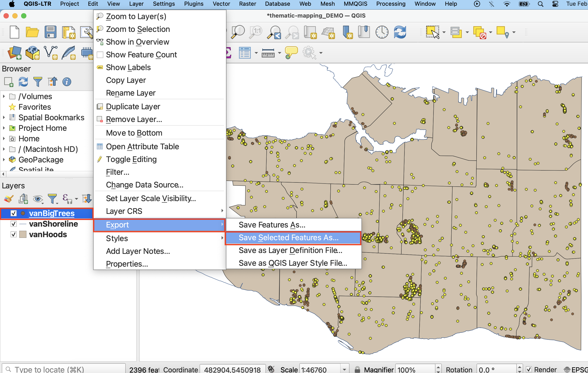

 
*2*{: .circle .circle-yellow} In the window that opens, give the new file both a name *and a location*. To give it a location, click on the three dots and navigate to the `thematic-mapping-workshop/data` folder. Call this file `vanDougFirs`. Everything else can remain as default. Click **OK**. 

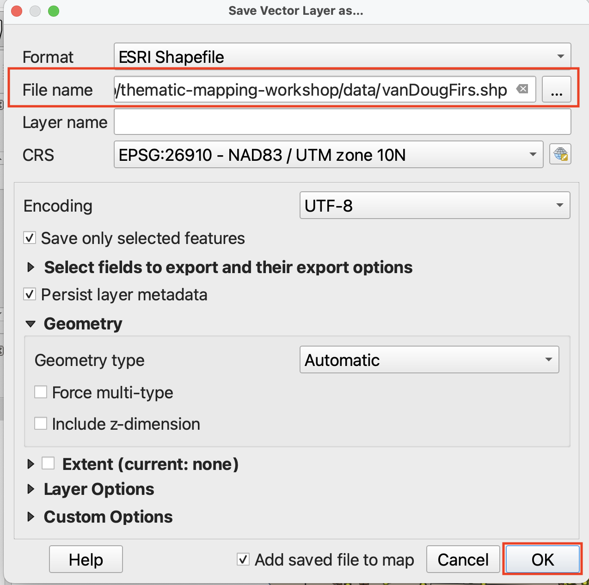

 
*3*{: .circle .circle-yellow} The new layer should add automatically to your map. If not, add it now. 

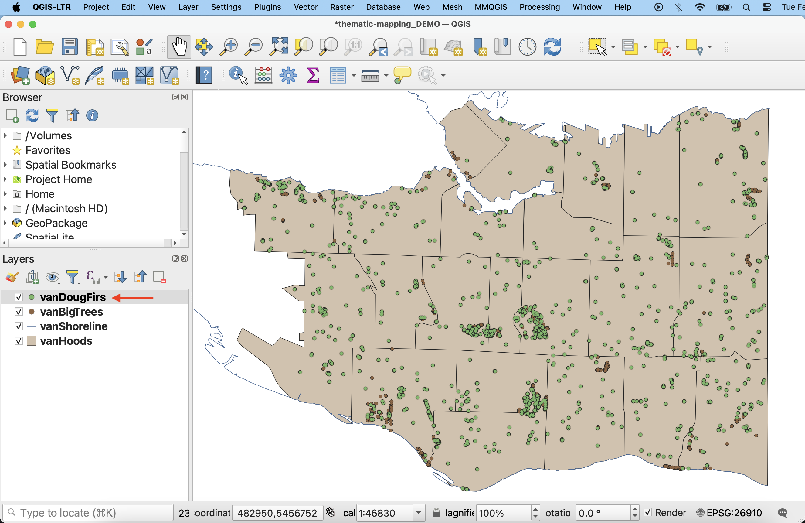

 
*4*{: .circle .circle-yellow} Remove `vanBigTrees` (by right-clicking the layer) and **save your project**. 

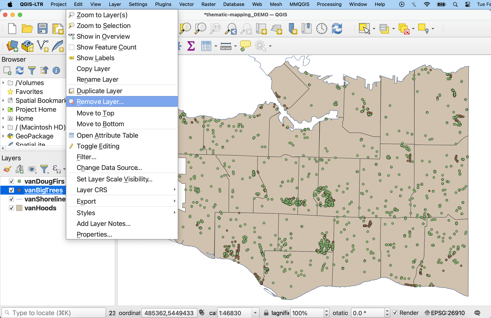

<!-- # Layer Properties

open project

refer to mapping introduction for gui overview and data management

update symbology of neighborhoods and outline

add basemap 

-- -->

