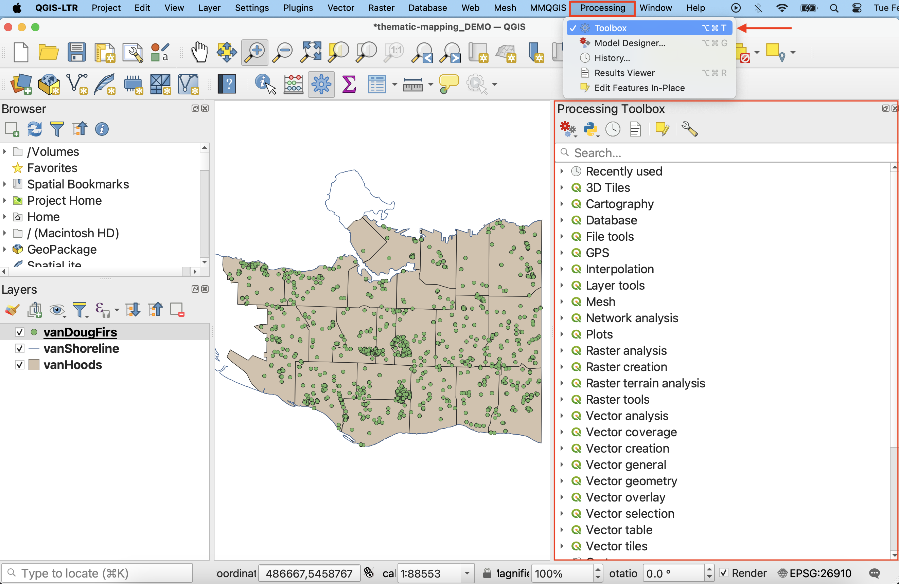
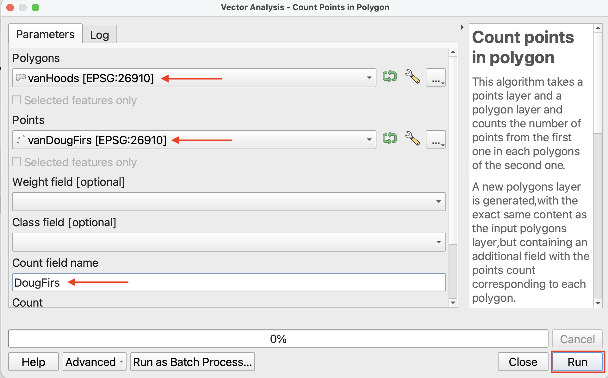
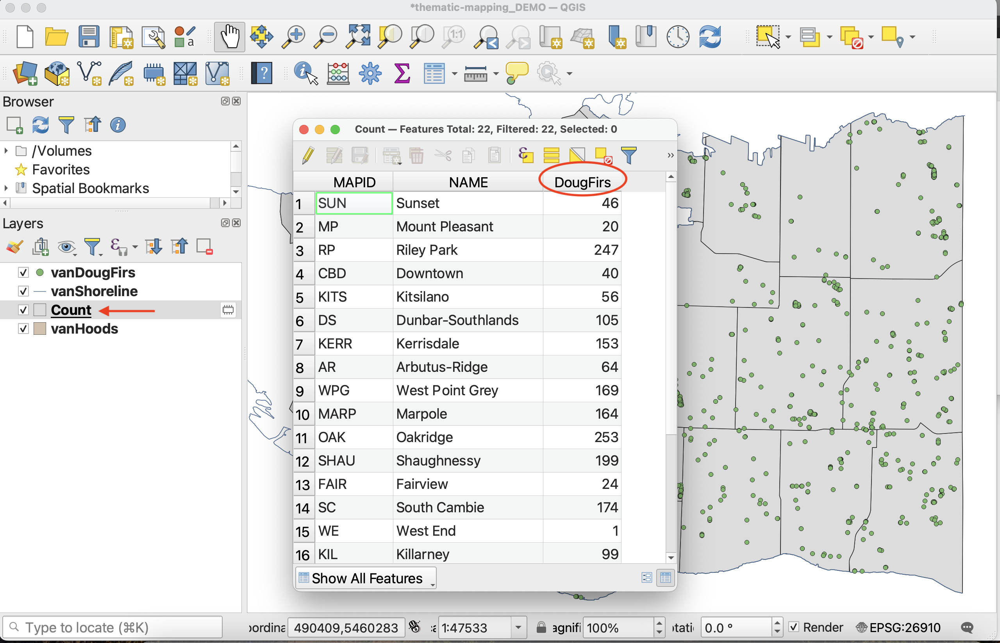

# Spatial Analysis

Remember, [QGIS](https://docs.qgis.org/2.18/en/docs/gentle_gis_introduction/spatial_analysis_interpolation.html#:~:text=Overview,Geographic%20Information%20System%20(GIS).) defines spatial analysis as "the process of manipulating spatial information to extract new information and meaning from the original data." Today's workshop is only concerned with vector data, and therefore we will focus on **vector analysis**. 

Since our goal is to create a thematic map that visualize the spatial distribution of Douglas Fir street trees across Vancouver, we need to find out how many Douglas Firs are in each neighbourhood. While we could count up the many, *many* points by hand, this would take a long time and could introduce human error. Instead, we will use QGIS vector analysis tools to do the counting for us. 

See our workshop on <a href="https://ubc-library-rc.github.io/gis-tools-workflows/content/vector-tools.html#vector-tools" target="_blank">Tools and Workflows in QGIS</a> for further information on vector analysis tools.

----

## The Processing Toolbox
There are two main ways to access spatial analysis tools in QGIS: 1. through the **Vector** menu and 2. through the **Toolbox** located in the **Processing** menu. 

To Do
{: .label .label-green }

Go ahead and open the **Processing Toolbox**. 

If you don't see the **Processing** menu at the top of your screen, you may have to enable the processing plugin. Click on the **Plugins** menu at the top of your screen, and then on **Manage and Install Plugins…**. In the search bar, type in "Processing". Make sure to **select the Processing box**, and then click Close. You should now see the Toolbox icon and be able to proceed with the next steps. Once enabled, you will be able to access the Processing menu anytime you open this or any other QGIS project. 
{: .note} 
<!-- [Processing toolbox](https://docs.qgis.org/3.40/en/docs/user_manual/processing/toolbox.html) -->

 

## Count Douglas Firs
In the Processing Toolbox, search for the QGIS tool called **Count points in polygons**. It will be nested under **Vector analysis**. This tool will count the number of points (Douglas Firs) in each polygon (Vancouver neighbourhoods), and append the total to each neighbourhood in `vanHoods` as a new attribute. 

*1*{: .circle .circle-yellow} In the tool window, select the following inputs:

- **Polygons**: `vanHoods` 
- **Points**: `vanDougFirs` 
- **Count field name**: `DougFirs` (the name of the attribute that will store the total number of Doug Firs for each neighbourhood)

Click **Run**, then **Close** when the process has finished. Note: you may see the caution ‘No spatial index exists for points layer, performance will be severely degraded’. You can ignore this.

*You should now have a new layer called `Count` in your Layers Menu*. This is because, unless you specify the output of a tool to be a permanent layer, it will create a temporary layer with the tool's name. 

 
*2*{: .circle .circle-yellow} Drag `Count` below `vanDougFirs` in Layers Panel so the distribution of Douglas Firs remains visible on your Map Canvas. Take a look at the Attribute Table for `Count`. You can now see the number of Douglas Firs in each Vancouver neighbourhood. Close the attribute table to continue.

 

*3*{: .circle .circle-yellow} Save `Count` as a permanent layer to your data folder by right-clicking it and selecting either **Make Permanent** or **Export - Save Features As..**. Save the file to the `thematic-mapping-workshop/data` folder and call it `vanHoodsCount`. Everything else can remain as default. Click **OK**. Note that if you have any trouble exporting the file, it's likely because you didn't specify a location, just a name for it. 

 

*4*{: .circle .circle-yellow} Be sure to add `vanHoodsCount` to your project if it doesn't add automatically. Then, remove `Count`, `vanHoods`, and `vanDougFirs`. **Save your project**. 

 

<!-- ## Centroids: From polygon to point  -->

<!-- run centroid on count (for proportional symbol map later) or move to proportional symbol map section -->

