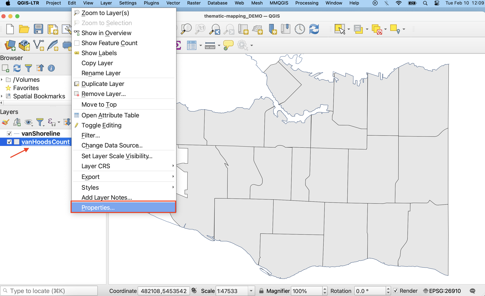
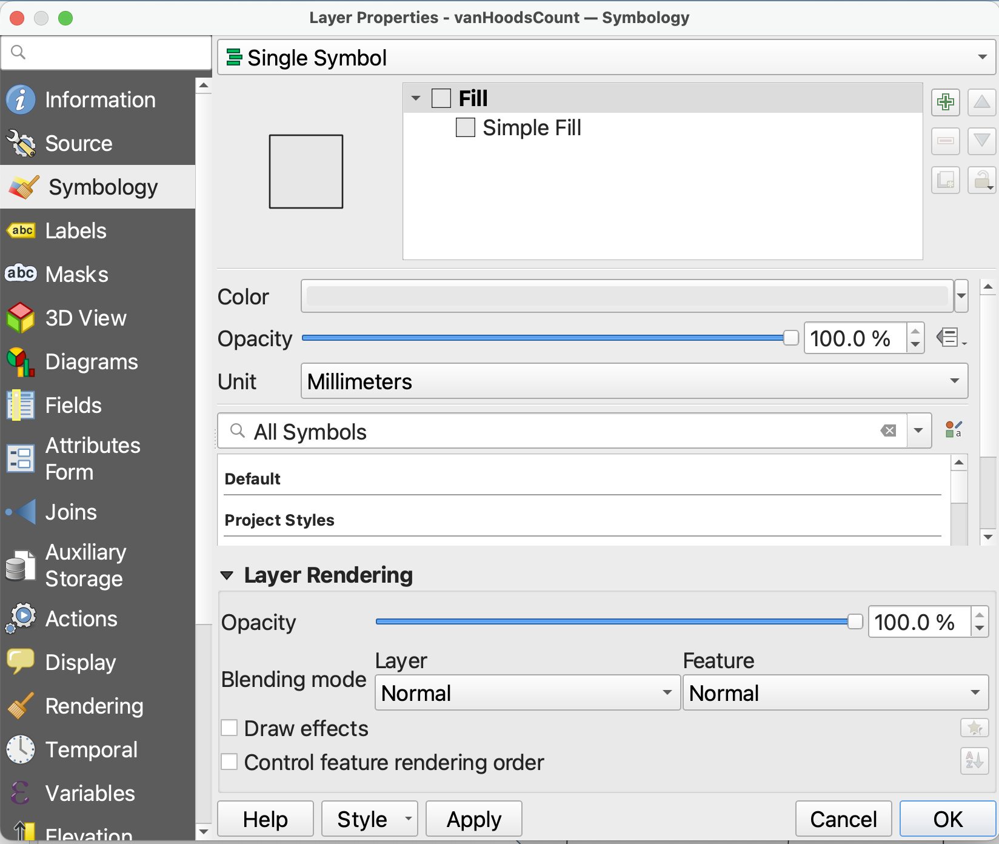
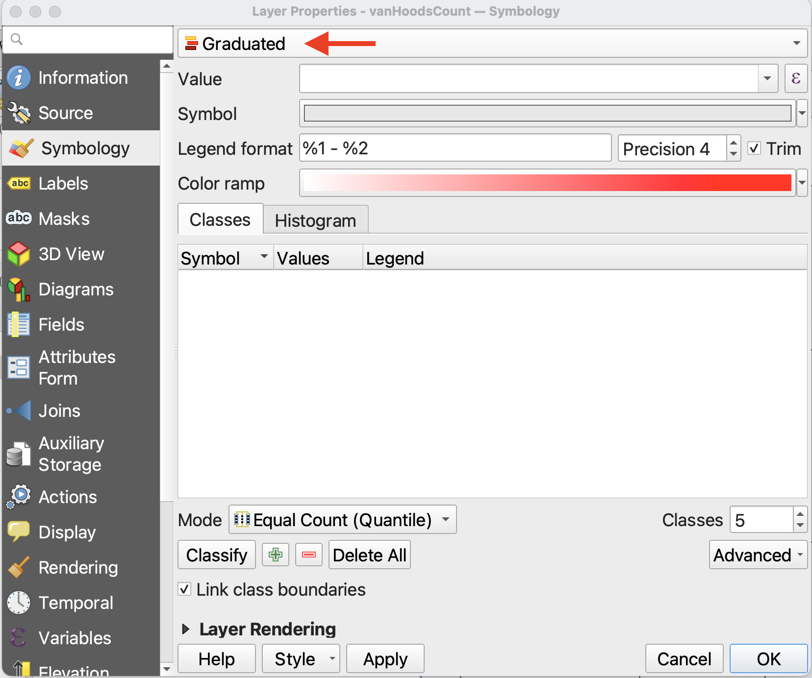
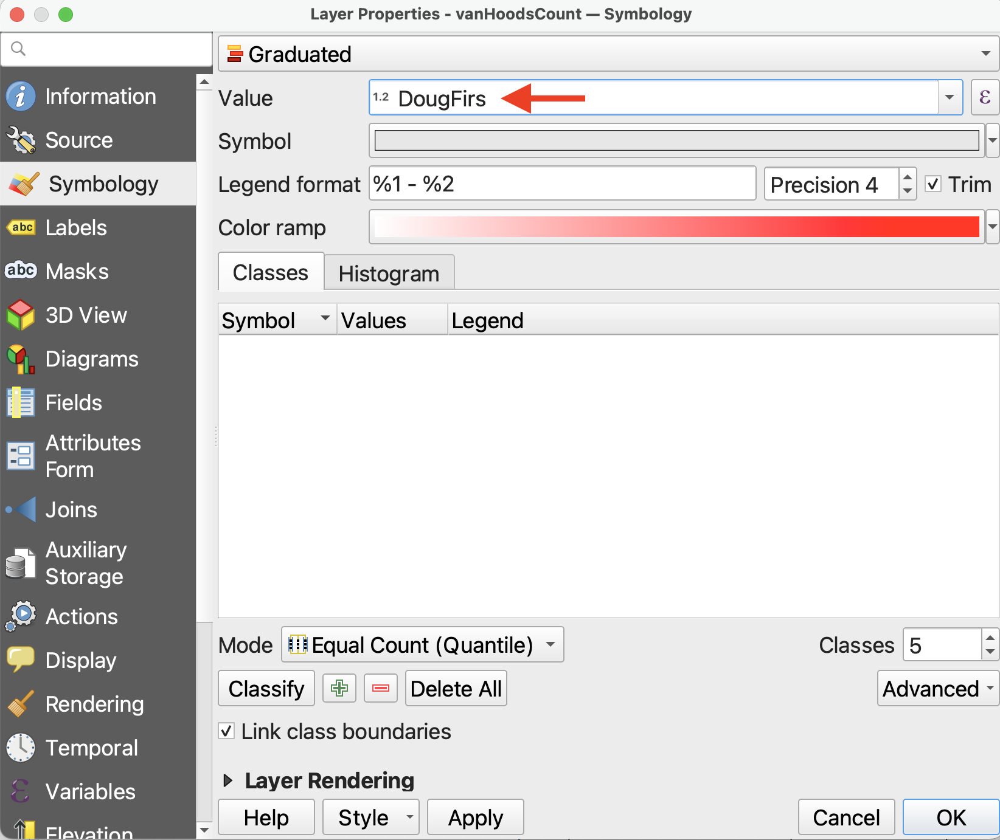
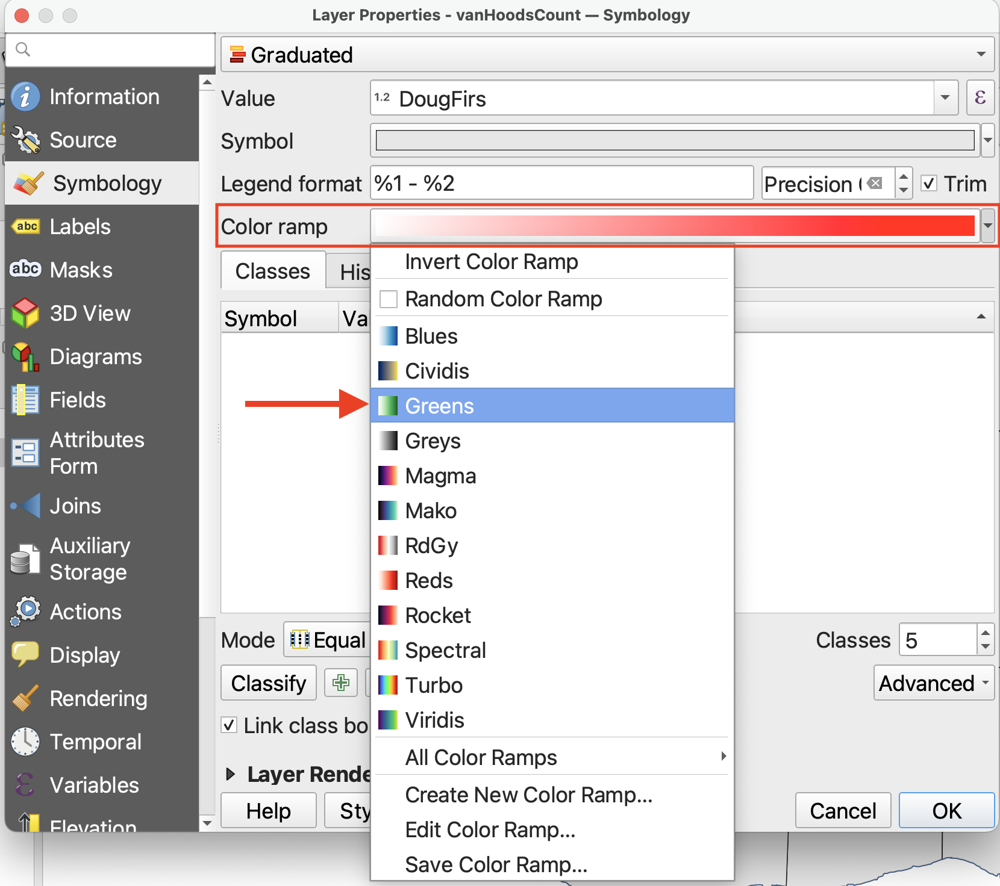
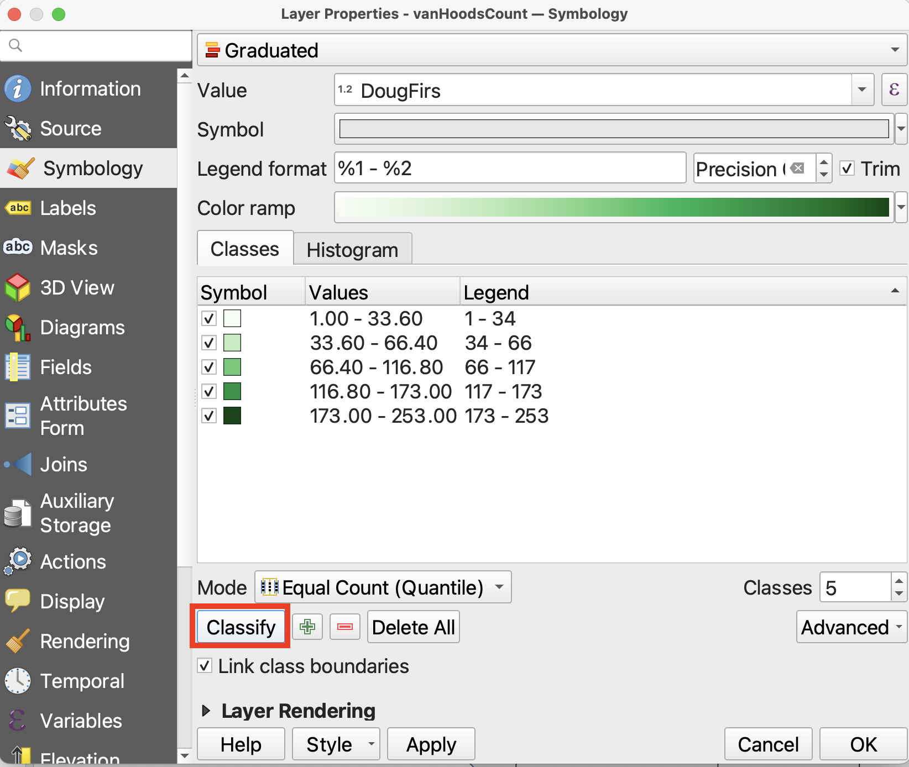
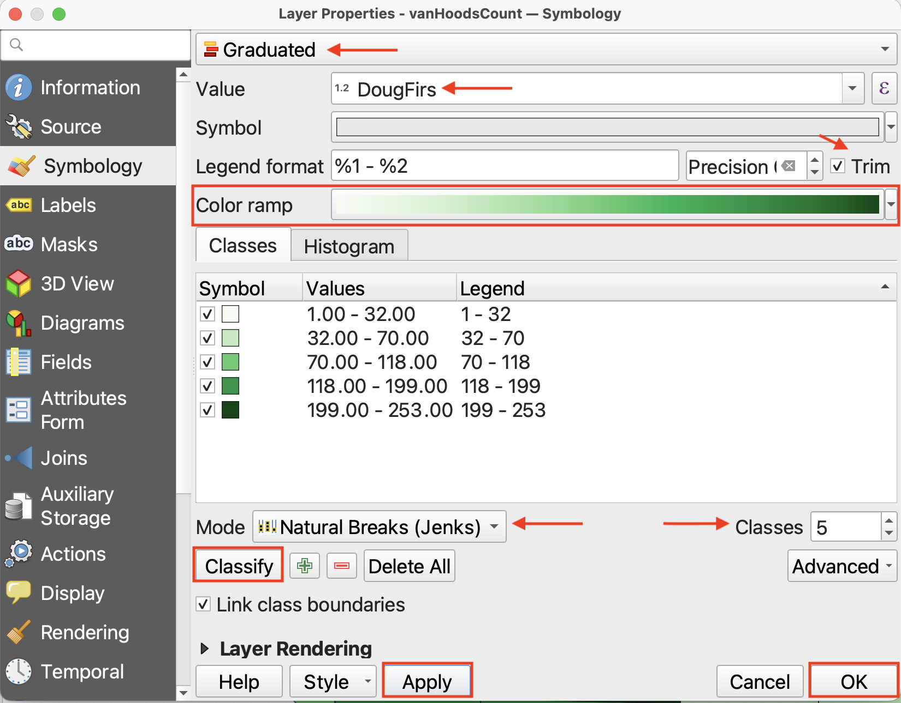
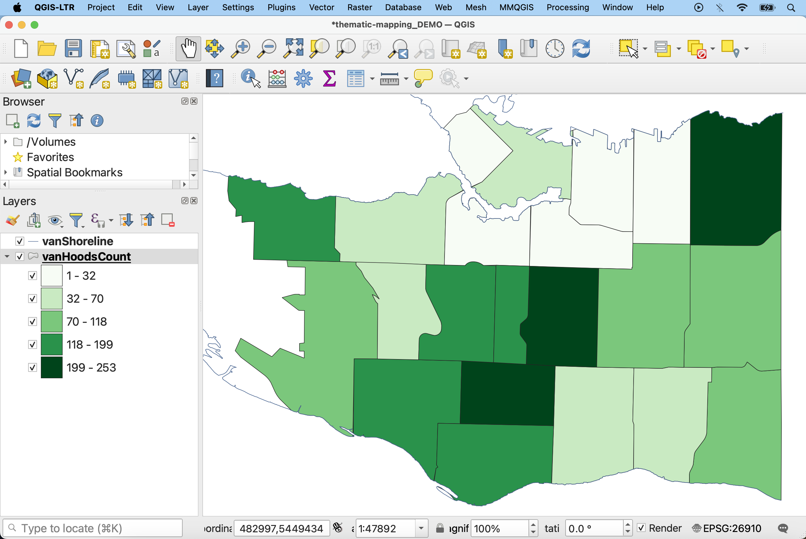

# Create a Choropleth Map

As it is, we can't glean any information regarding the number of Douglas Firs by looking at `vanHoodsCount`. However, as we saw in the Attribute Table, `vanHoodsCount` *does* contain this information. So, what we need to do is change the **Symbology** of `vanHoodsCount` to render visible values in the `DougFirs` column. We can use either color or shapes to do so. Let's begin by making a choropleth map, using a color gradient to visualize the number of Douglas Fir street trees in each Vancouver neighbourhood.

<!-- 
Remember, a choropleth map visualizes different values across standard geographic areas through gradations in color. So, what we need to do is change the **Symbology** of `vanHoodsCount` to render visible values in the `chestnut-trees` column. 

To create a choropleth map, we need to update the **symbology** of the layer `vanHoodsCount`.  Symbology is a layer property that governs the color, transparency, and line thickness of the features displayed. -->

 

*1*{: .circle .circle-purple} In the Layers Panel, right-click on `vanHoodsCount` and go to **Properties**. Then, in the Layer Properties window, navigate to the **Symbology** tab. 

 

*2*{: .circle .circle-purple} At the very top, we can see that the symbology is set to **Single Symbol**. This means every feature in the dataset is rendered in the same color. Since we want to a variation, with different colors reflecting the number of trees in each neighbourhood, we need to change the symbology. Click on **Single Symbol** and from the drop-down, choose **Graduated**. This will allow you to display graduated colors representing classes of attribute values.

 

*3*{: .circle .circle-purple} Set the **Value** to DougFirs. (Or Count, if you didn't specify the attribute back when you ran the Count Points in Polygon tool.) This tells QGIS which numerical field to visualize.

 

*4*{: .circle .circle-purple} **Precision** refers to how many decimals you want to include, and checking the **Trim** box removes trailing zeros from the legend. Because we are dealing with whole numbers of trees, so long as Trim is checked it doesn’t matter the precision.

 

*5*{: .circle .circle-purple} You can select a color ramp from the given options, or design your own. Hover over “All Color Ramps” to see all options. For now, change the color ramp to **greens**. 

 

*6*{: .circle .circle-purple} So far, we’ve set up the symbology but we have to apply it to our values. Click **Classify** to classify the `DougFirs` values. (If nothing shows up, check the attribute table of `vanHoodsCount` to ensure `DougFirs` is a numerical field.) 

Then, click **Apply** to see your map change. Only after clicking **Classify** and then **Apply** will you see the results.

 

*7*{: .circle .circle-purple} Change the classification **Mode** to **Natural Breaks (Jenks)**. Keep the number of **Classes** at **5**. 

- While the default classification mode is set to Equal Count (Quantile), you can choose amongst different classification modes. Classification modes determine how the distribution of data are grouped or “classified”, and therefore which values are associated with which colors. You can also increase or decrease the number of classes. Between 5 and 7 is best practice. Read more about different classification modes [here](https://pro.arcgis.com/en/pro-app/latest/help/mapping/layer-properties/data-classification-methods.htm). 

- If you toggle to the **Histogram** tab, you can click **Load Values** to see the distribution of `DougFirs` values. The X-axis indicates number of chestnut trees whereas the Y-axis, “Count”, refers to the number of neighborhoods with this number of chestnut trees. The number of bins refers to how granularly the number line is broken down. 
<!-- Currently there are 30 bins, from 0 to 300—meaning any neighborhood with a count that isn’t a multiple of ? will be split. -->

<!-- Set the following inputs

- **Value**: DougFirs (what this does)
- **Precision**: 0 (what this does)
- Check the box for Trim
- **Color Ramp**: pick a color ramp that looks like it would represent the prevalence of Douglas Firs.
-  **Mode** : Natural Breaks (Jenks) (see more on classification)
- **Classes**: 5 -->

 

*8*{: .circle .circle-purple} Click **Apply** again and drag/resize your symbology window so you can see your map canvas. When you are satisfied, click **OK** and close the Layer Properties/Symbology window.

<!-- ## Field calculator - though this would be after count points in polygon... 
3. also do math in attribute table to normalize. - number of douglas firs as percentage of street trees - (would have needed to include total number of street trees per neighborhood earlier. still can do but need to update dataset) -->
