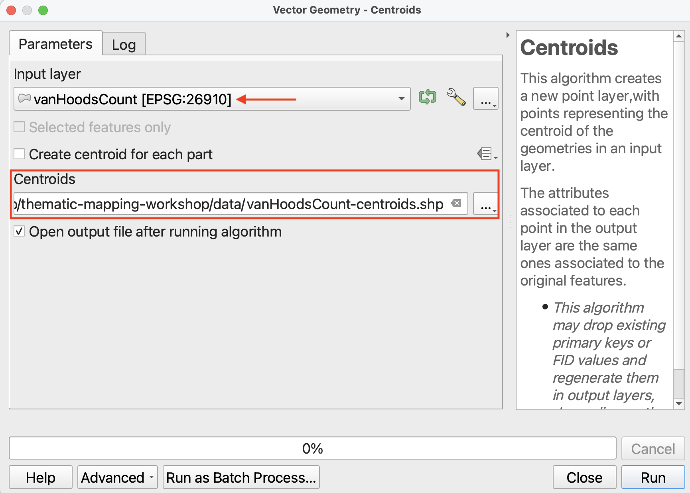
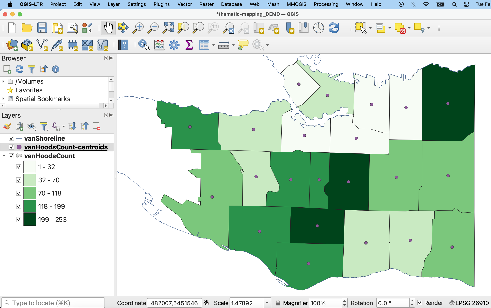
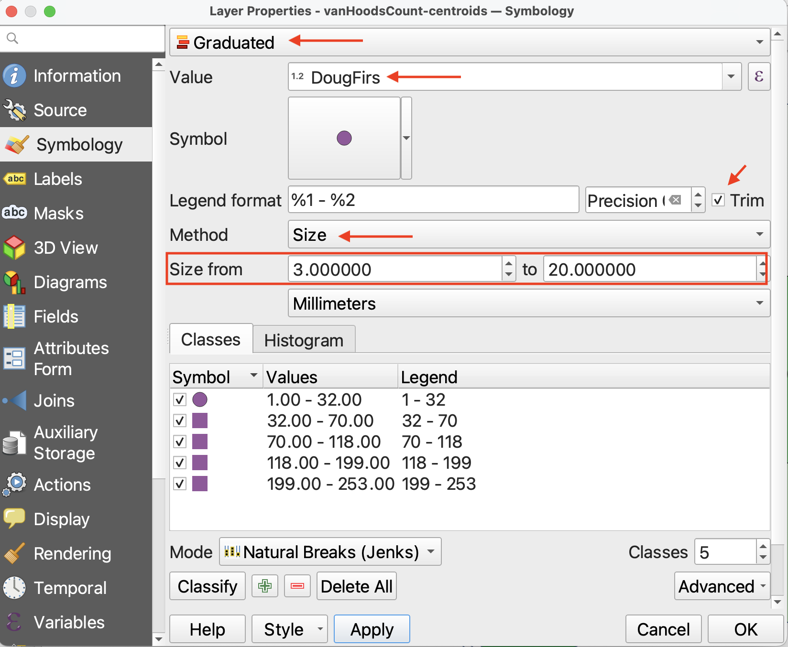
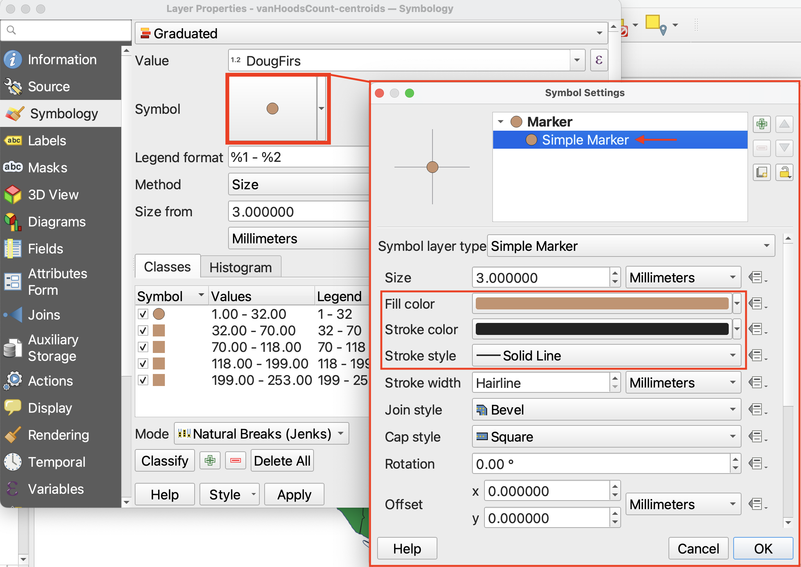
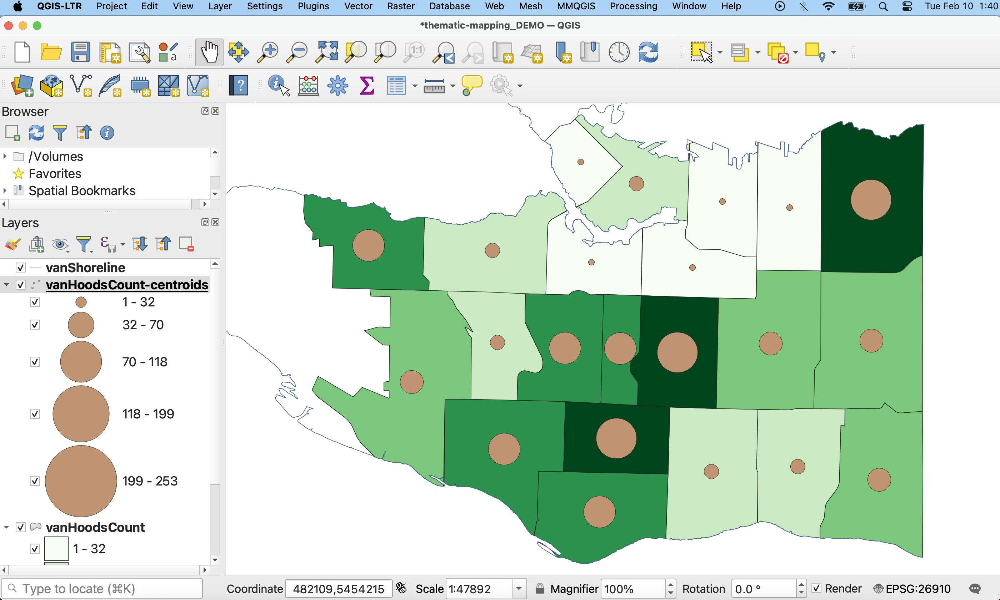

# Making a Proportional Symbol Map

You can make proportional symbol maps in QGIS simply applying a **graduated symbology** to a point layer, where each point represents a standard geographic area and contains a value of interest. 

Currently, we have a polygon layer `vanHoodsCount` but no point layer for neighbourhoods. We can turn this layer into a point layer, however, by running another QGIS processing tool. 

*1*{: .circle .circle-yellow} In the **Processing Toolbox**, search for the tool called **Centroids**. It should be under **Vector Geometry**. 

Run the **Centroids** tool with the following parameters:

- **Input layer**: `vanHoodsCount`
- Save the output layer as a file to your `thematic-mapping-workshop/data` folder, and call it `vanHoodsCount-centroids`. 
<!-- To save the output file as a permanant layer even before running the tool,  -->

 

*2*{: .circle .circle-yellow} If not automatically added to your map, load `vanHoodsCount-centroids`. 

  
*3*{: .circle .circle-yellow} Open the Layer Properties of `vanHoodsCount-centroids` and navigate to the **Symbology**. 

- Change the symbology type to **Graduated**.
- Set the **Value** to `DougFirs`.
- Then, **change method to Size**.
- Change the minimum size to **3** and the maximum size to at least 20. 

Then, hit **Classify** and **Apply**.

Just like in the previous page, you can change the classification mode.

*4*{: .circle .circle-yellow} To change the symbol symbology, click on Symbol option and then select “Simple Marker”.

*5*{: .circle .circle-yellow} When you're satisfied, click **OK** and return to the map view. 

