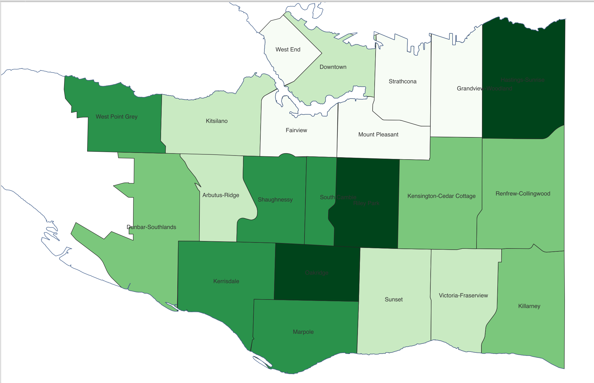
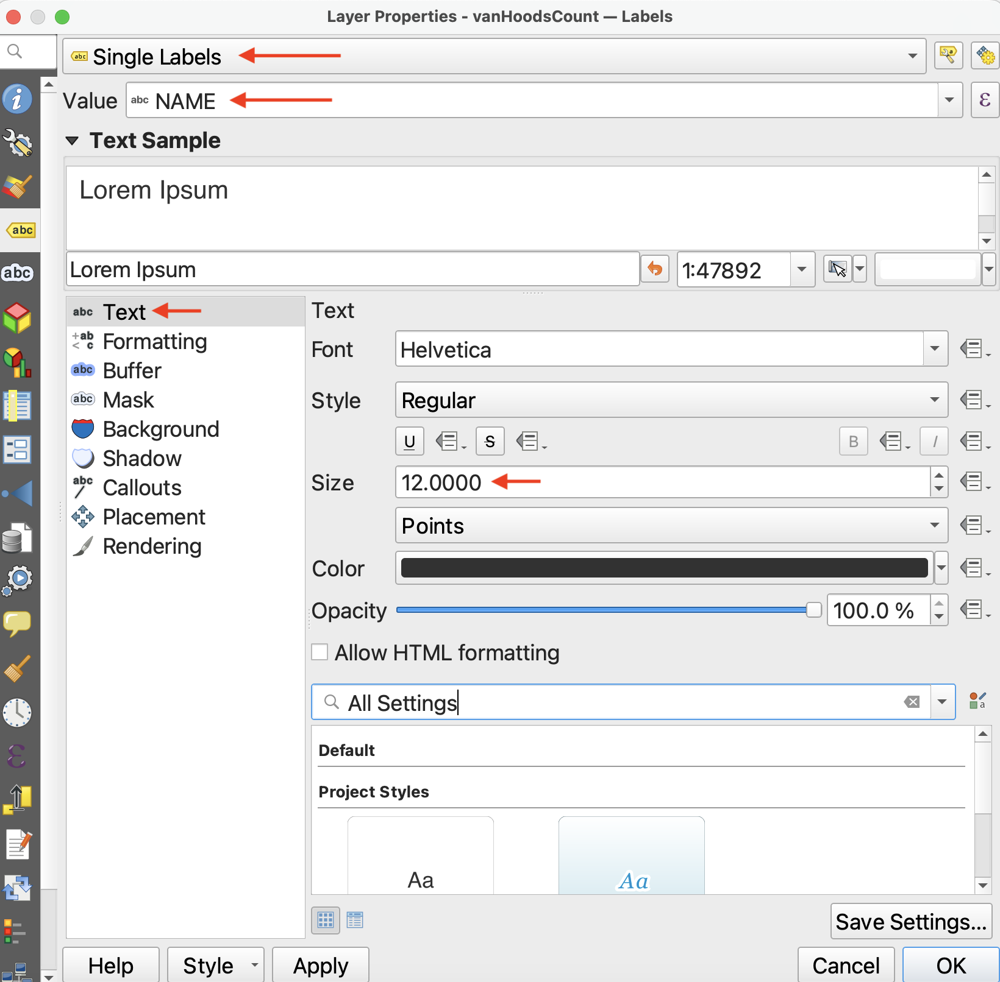
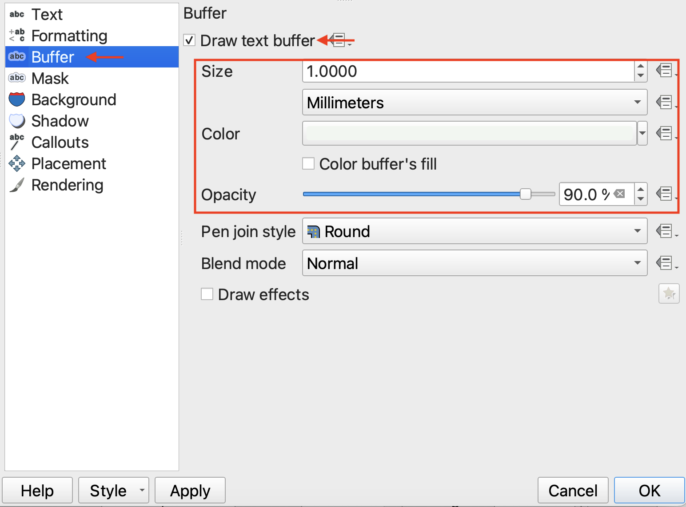
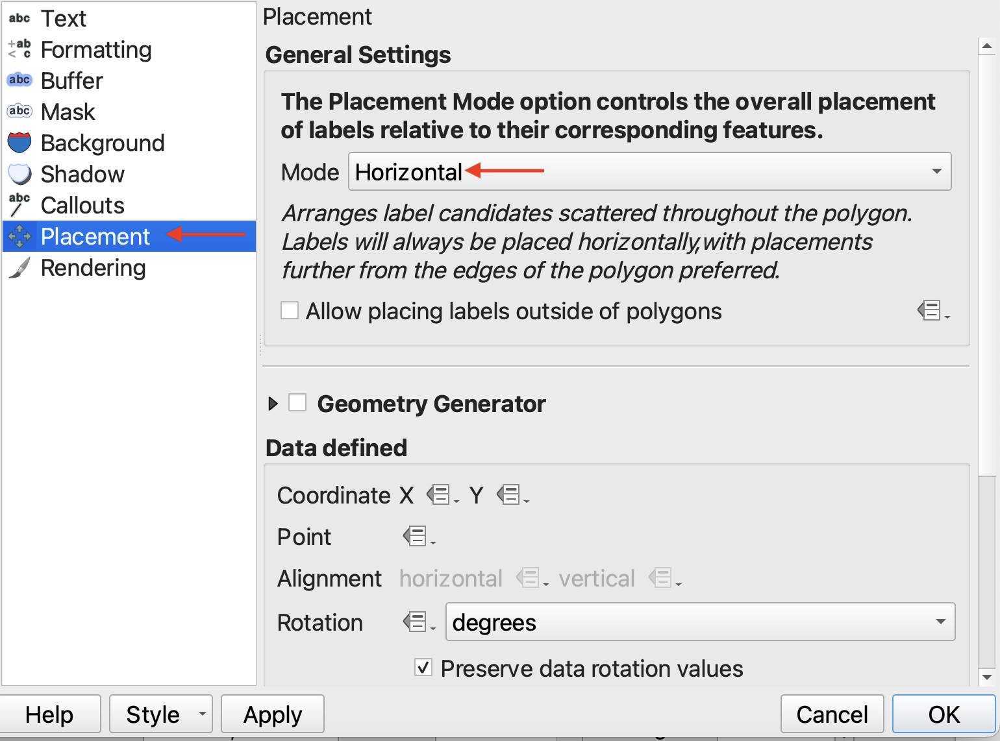
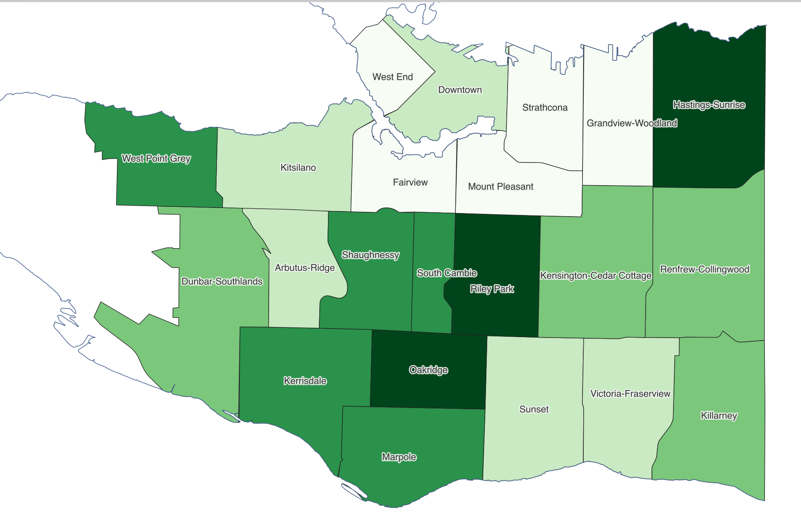
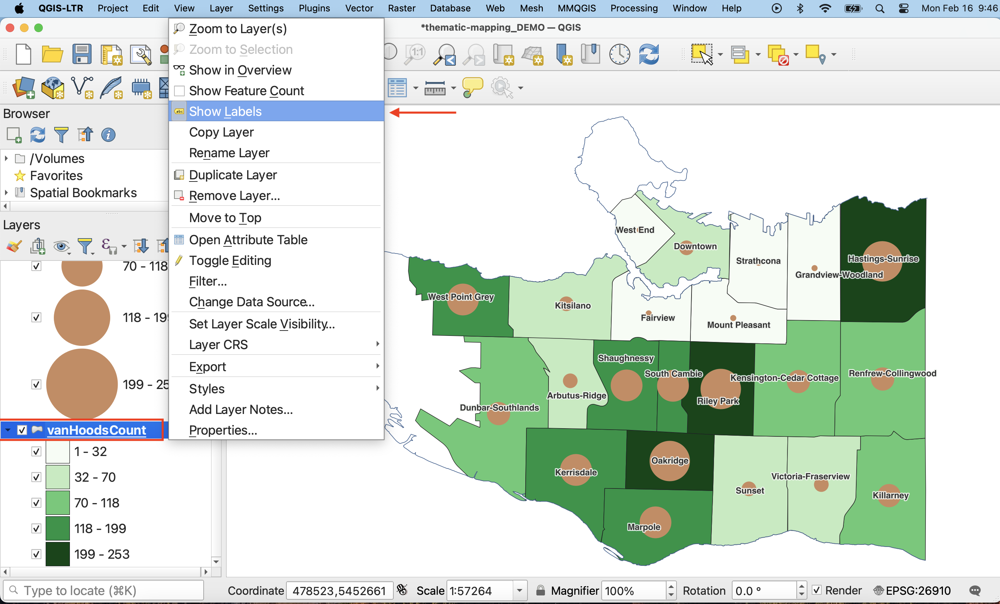
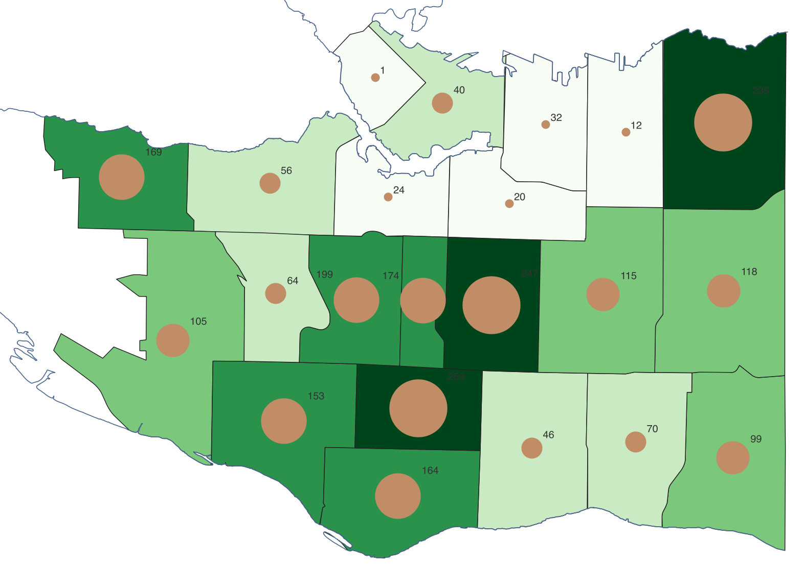
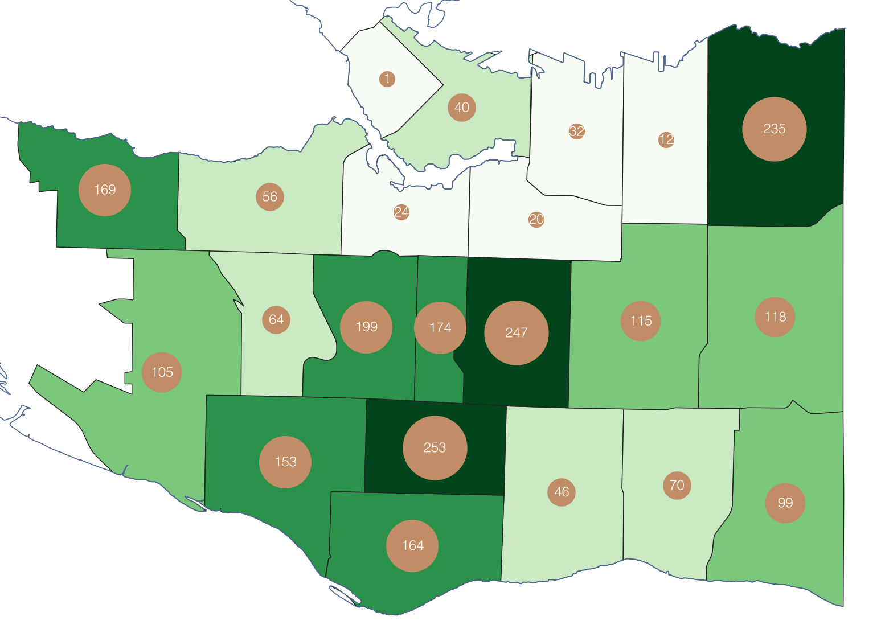
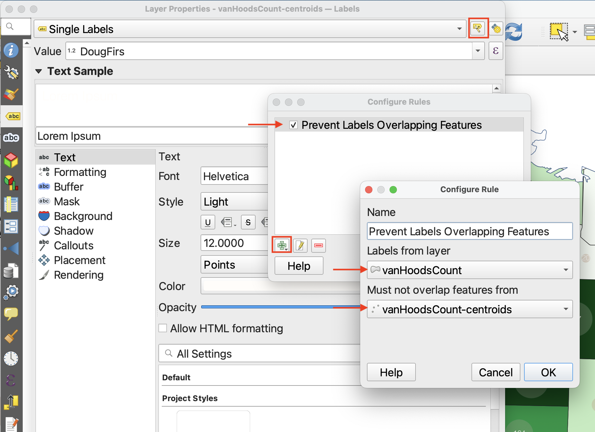
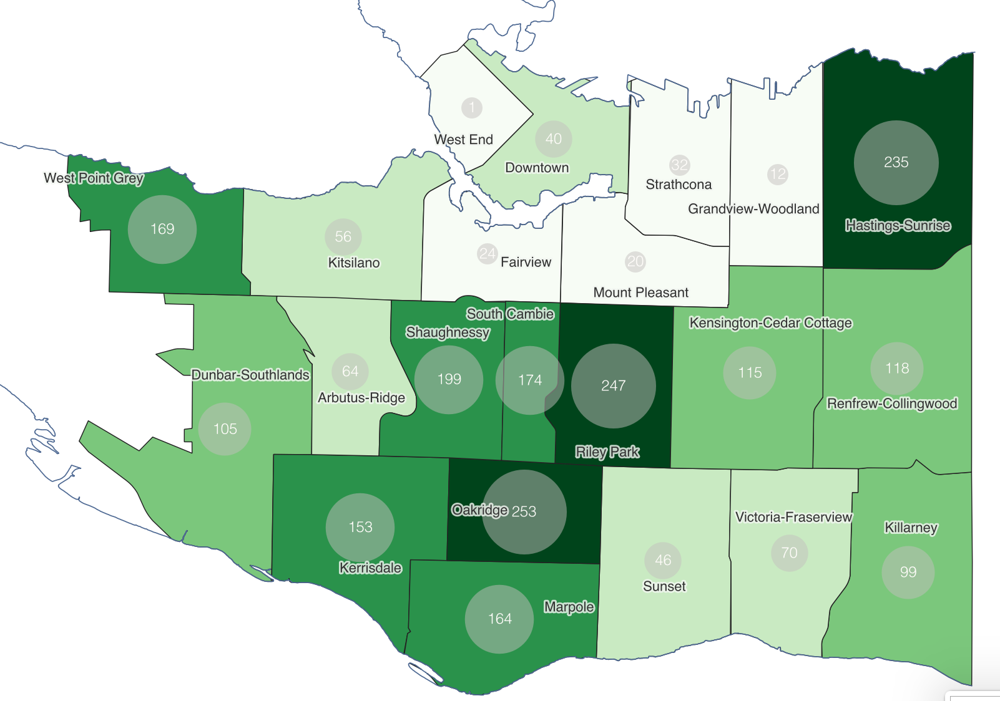

# Adding Labels
We now have two thematic visualizations of Douglas Fir street trees by Vancouver neighbourhood. However, some contextual information might be useful, such as the names of neighbourhoods and/or the total number of Douglas Firs in each neighbourhood. 

---

## Label Neighbourhoods
First, let's add the names of neighbourhoods to our choropleth map. Turn the proportional symbol layer off so it isn't distracting. 

*1*{: .circle .circle-yellow} Open the Layer Properties for `vanHoodsCount` and navigate to **Labels**. Currently, no labels are set. 

Set labelling to **Single Labels** and set the **Value** to `NAME`. Click **Apply** and see what the map looks like.

  

*2*{: .circle .circle-yellow} While labels appear for the neighbourhoods, they are a bit difficult to see. There are a couple things we can do to make the labels more visible. 

- 2.1 Back in the Layers Properties, increase the **font size** to at least 12 Points. 

 

- 2.2 Add a **Buffer** around the text, something light colored like white but then drop the opacity a bit. 

 

- 2.3 Then, go down to **Placement** and change the placement to horizontal. 

 

 

## Label Proportional Symbols
Now, let's add the total number of Douglas Firs in each neighbourhood to our proportional symbol map. 

*1*{: .circle .circle-yellow} Turn the proportional symbol layer back on. You'll notice the neighbourhood labels obscure some of the symbols. You can Toggle on and off a layer's labels (without deleting your label settings) by right-clicking the layer, and selecting **Show Labels**. If labels are on, they will turn off, and vice versa. 

 
*2*{: .circle .circle-yellow} Now, just like above, open the Layer Properties for `vanHoodsCount-centroids` and navigate to **Labels**. Currently, no labels are set.

 

*3*{: .circle .circle-yellow} Set labelling to **Single Labels** and set the **Value** to `DougFirs` (or `Count`). Click **Apply** and see what the map looks like.

 
*4*{: .circle .circle-yellow} Just like before, adjust the font size and color, and change the Placement mode, this time to “Offset from Point”. This will allow you to visualize the number above the symbol.

## Label Visibility 
You may notice that the labels are lost over the smaller points, which means you might want to increase the size of the smallest points in your symbology. 

If you just want to have proportionals symbols against the neighbourhoods, consider adding `vanHoods` back to your map as a baselayer.

If you want your map to have both layers, you might need to adjust the Placement of one or both labels. Alternatively, you can tell QGIS not to overlap layer labels by "configuring project labeling rules". 

--- 

***Once you are finished symbolizing your maps and adding labels, remove any unnecessary layers from your QGIS project.***

