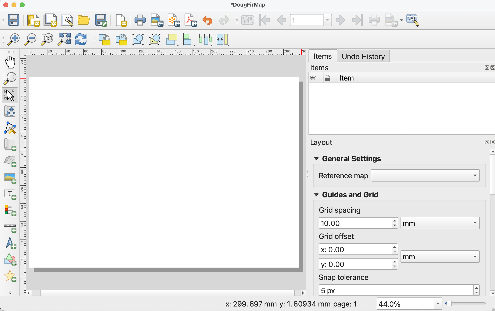
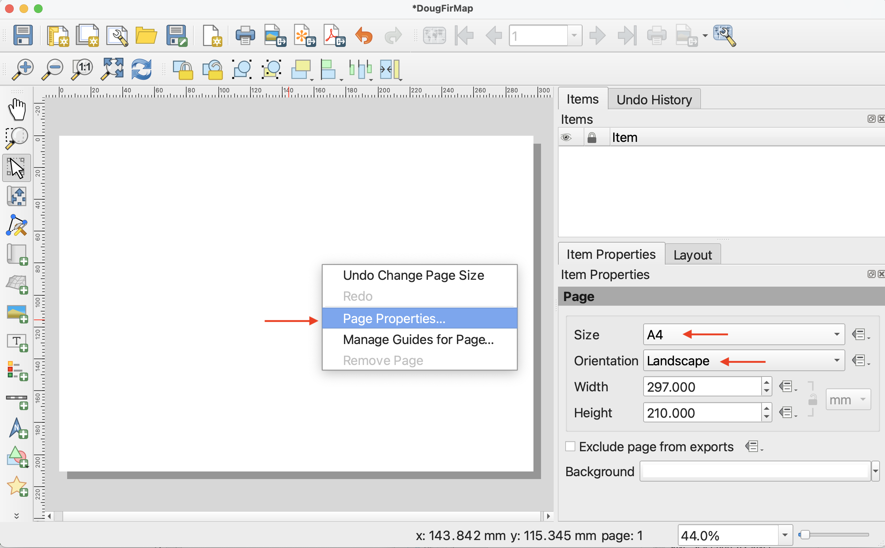
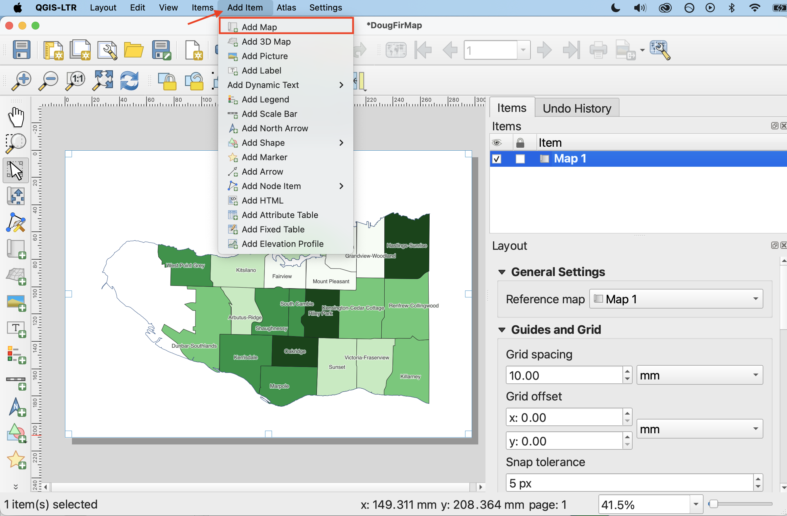
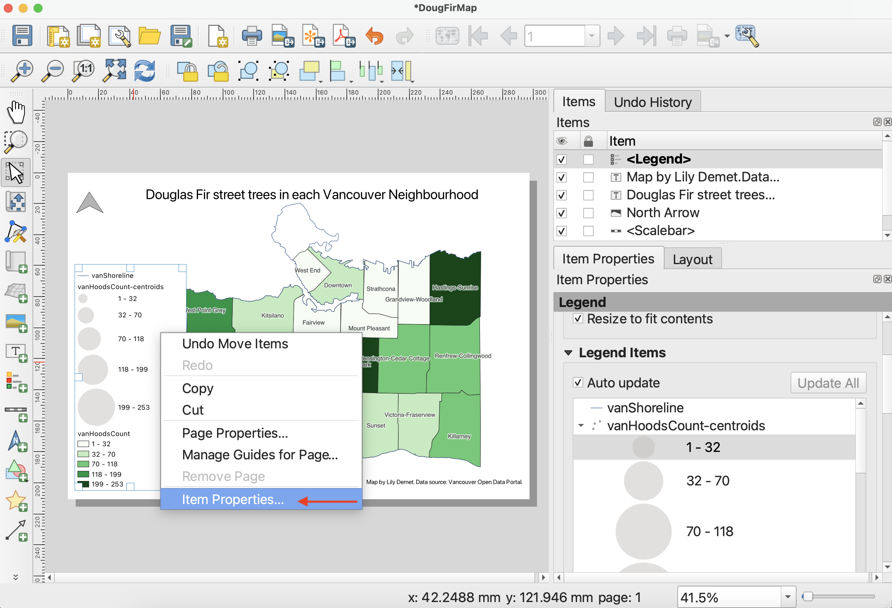
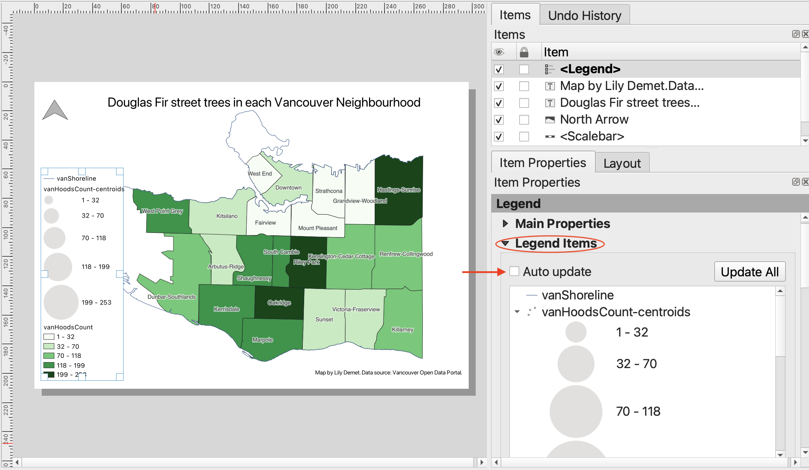
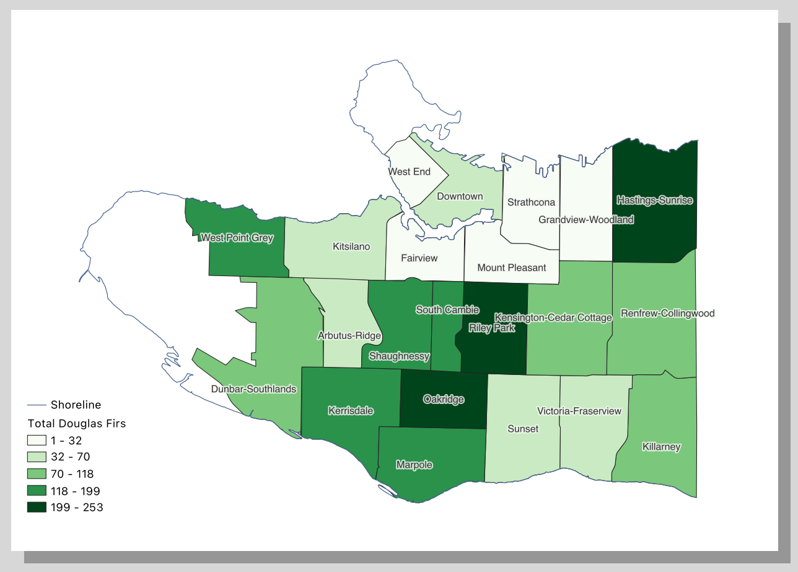
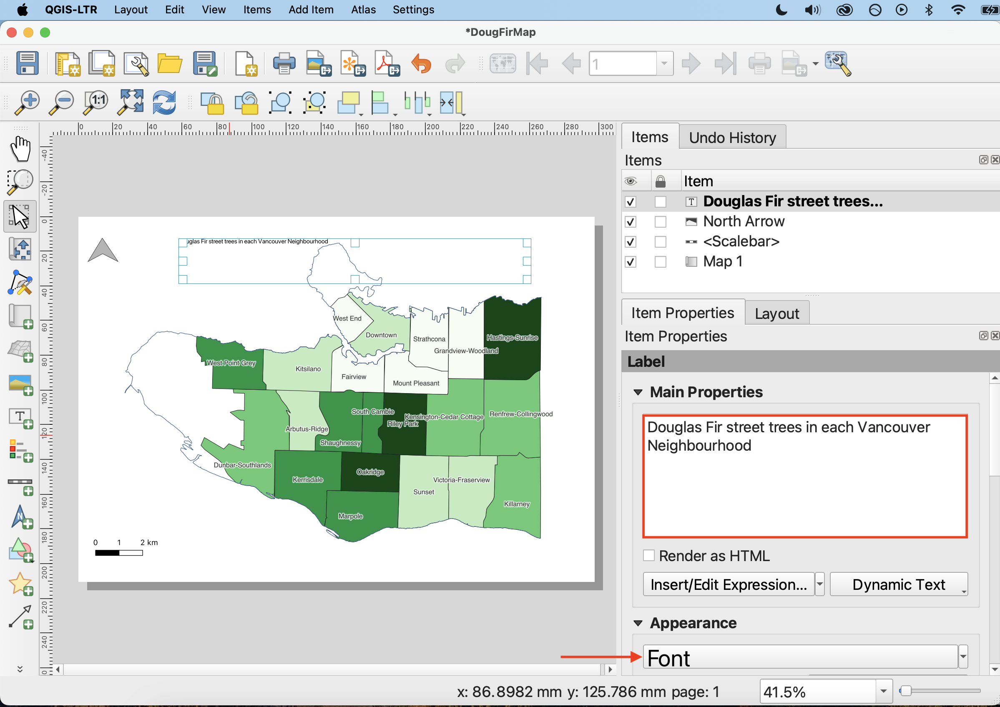
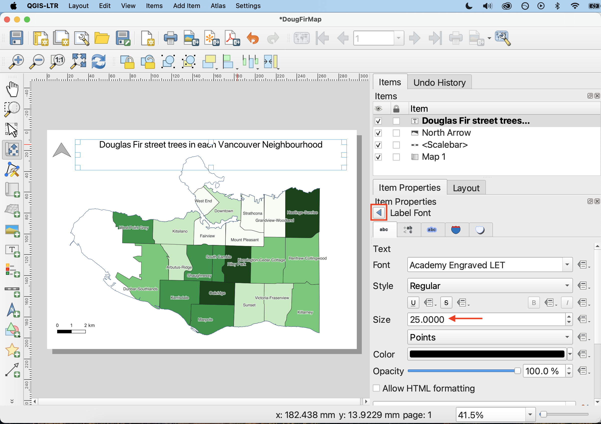

# Creating a Print Layout

Once you are satisfied with your layer symbology, it’s time to create a **Print Layout**. Think of the Print Layout as a drawing board where you can add the map you created, as well as a myriad of other elements like a title, legend, scale bar, north arrow, and map author/data source. 

You can create multiple Print Layouts per QGIS project. By giving each Print Layout a unique name, and saving it (and saving your QGIS project) regularly, you can return to a Print Layout from the Project Menu and continue working.

- See The QGIS user guide here for a comprehensive introduction to the [QGIS Print Layout](https://docs.qgis.org/3.40/en/docs/training_manual/map_composer/map_composer.html).

- For a more detailed tutorial on map production, including customization of map elements, please refer to the Research Commons' workshop on <a href="https://ubc-library-rc.github.io/gis-reference-mapping/content/hands-on5.html" target="_blank">Mapping for Academic Publication</a>

----

## Create a thematic map
For today's workshop, we will create a print layout of the **choropleth map**. 

*1*{: .circle .circle-yellow} Create a new Print Layout by going the Project menu, and down to “New Print Layout”. In the pop-up window, name the layout "Doug Fir Map". 

This will open the Print Layout window. It looks quite similar to the main QGIS interface, so be careful not to edit the wrong thing. Notice, too, that once you’ve clicked into the Print Layout window, the menu at the top of your screen changes.

*2*{: .circle .circle-yellow}
To change the dimensions of the page, go to "Page Properties..." by right-clicking anywhere on the page's whitespace.
 <!-- You can also find Page Properties in the **Layout** menu at the top of your screen.  -->
In Item Properties, you can change the layout to your desired dimension. For now, let's keep the dimensions set to **A4** and orientation set to Landscape.

 

*3a*{: .circle .circle-yellow} Now let's add the necessary items to our Print Layout: map, legend, north arrow, scale bar, data source statement and title. We can add items using the icons on the left-hand vertical toolbar or the **Add Items menu** at the top of the Print Layout window. 

*3b*{: .circle .circle-yellow} Add the **choropleth map** to your Print Layout. To do this, click on "Add Map" from the Add Items menu. Your curser should turn into a crosshair when hovered over the page whitespace. Drag diagonally across your Print Layout page, corner to corner.  

Center the map on your page and zoom to your desired level by manually adjusting the scale in the map properties. 
  - To move your map around within the frame itself, use the **Move item content** tool from the left-hand toolbar.  

  - To select, resize, or move content like the map itself, use the **Move/Select item** tool.

Once you add an item to your Print Layout, it will also show up in your Items list. The Items list is similar to your Layers Panel, but for the Print Layout. Click on any item in your Items list to view and modify its properties.

 

*4*{: .circle .circle-yellow} Add a **Legend** to your Print Layout in the same manner as above. Only features symbolized by your map should be included in your legend. Additionally, the names of relevant layers should be updated so they are understandable to the viewer. 

-  To edit the legend items, right-click it and select **Item Properties**.  

 

-  In the Legend Items section, collapse **Main Properties** so you can see **Legend Items**. Now, **uncheck the ‘Auto update’ box**. 

- To remove any unnecessary layers, select the layer you want to remove and then click the big red minus sign. You may need to collapse the layer and scroll down. Be sure to remove `vanHoodsCount-centroids`.

-  To rename a Legend item, simply double-click on the item and type in the text box that opens. Remember to click the back button to return to the the item properties. Rename `vanShoreline` and `vanHoodsCount`. 

 

 

*5*{: .circle .circle-yellow} Add a **Scale Bar** and a **North Arrow** to your map. You can customize both items in the **Item Properties**. Best practice is for your scale bar to be in **metric units**. 

<!-- *6*{: .circle .circle-yellow} Add a **North Arrow**. In Item Properties, you will notice under Picture that your north arrow is currently an SVG (Scalable Vector Graphic) image. Click ‘Raster image’ instead and see what happens.

Under item properties, scroll down until you see Image Rotation. Choose Sync with map, then select the map you’d like to sync with. For type of North alignment select Grid North or True North. -->

 

*6*{: .circle .circle-yellow} Using the **Add label** item option, add a title along the lines of "Douglas Fir street trees in each Vancouver Neighbourhood". In the Item Properties, scroll down to Appearance and click ‘Font’. In the pop up window you can adjust the font and size of your title. 

Finally, it's customary to include the map author and data sources. Again using the **Add label** item option, add your name and the data source statement such as `Data source: Vancouver Open Data Portal.` to the bottom of your map. 

<!-- 
*7*{: .circle .circle-yellow} Finally, you can add a neatline to the map item itself. A neatline is the border around your map frame. You can add a neatline by turning on the **Frame** option of your map item, and then styling it.  -->

<!-- We can add this as its own shape, or add border to map item itself.  -->

