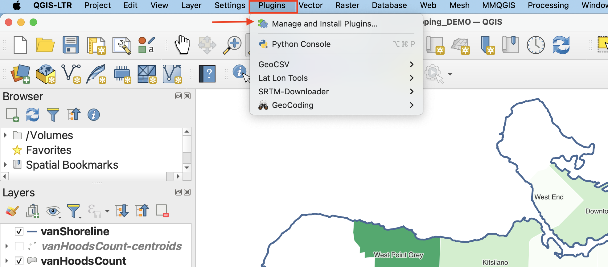
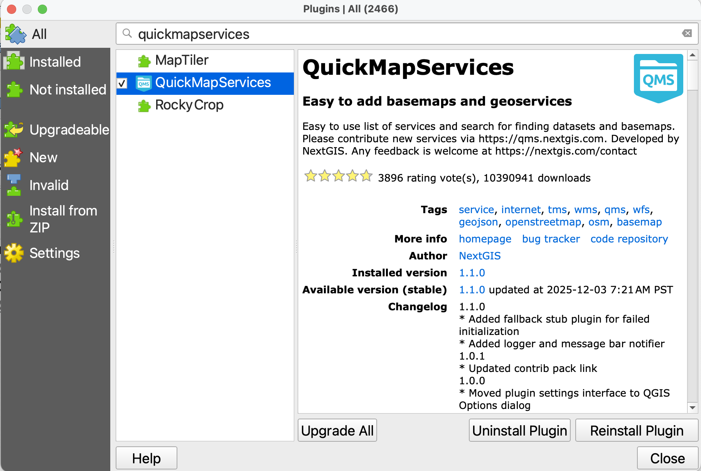
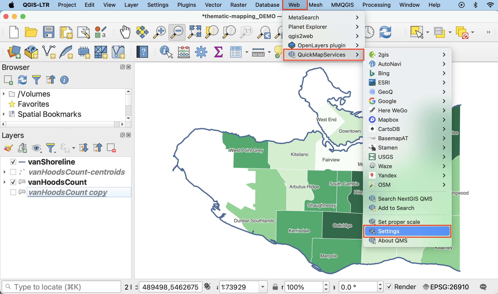
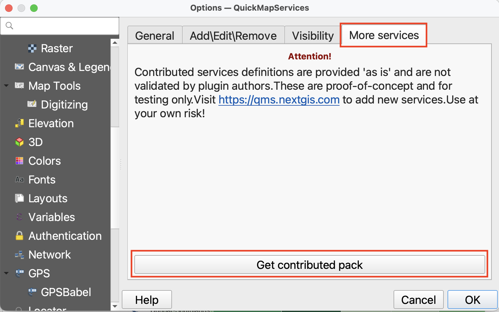
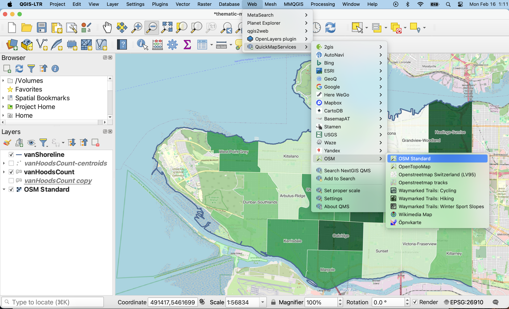

# Add a Basemap

***Save and close your print layout, and return to the main QGIS interface***

A **basemap** is helpful to give spatial context to your data layers—both as you’re working and in your final map. You can also create a reference map that is simply a basemap. For example, the map made over the course of this workshop used Natural Earth data to show the countries surrounding Canada. Another way to add geographic context is through a web-based basemap. Web-based basemaps are maps of the whole world that are stored on servers and which you can add to your project without downloading them to your local computer. The following page will guide you through adding web-based basemaps to your QGIS project.

## Adding basemaps from web plugin
While your out-of-the-box QGIS application will have a few basemap options under the XYZ tab of your Browser Panel, you can access way more with a plugin. [QGIS Plugins](https://plugins.qgis.org/) are user developed tools that extend QGIS functionality beyond the basics. There are two popular plugins for webmap libraries called QuickMapServices and OpenLayers.The following documentation will show you how to install the QuickMapServices plugin, add basemaps to your QGIS project, and create and export a map using one of them. 

### Install Plugin
[QGIS plugins](https://plugins.qgis.org/) are user developed tools that extend QGIS functionality beyond the basics. To access basemaps, we'll first install the QuickMapServices plugin. Click on the **Plugin** menu at the top of your screen and select **Manage and Install Plugins...**

In the dialogue box that opens, select **All** as a search category on the left and type "QuickMapServices" as one word. Install the plugin and close the dialogue box.

### Add Basemap
Now go to the **Web** menu at the top of your screen. You should see the QuickMapServices plugin. 

Hover over it and click "Settings" at the bottom of the menu that pops up. In the settings dialogue box go to the "More services" tab and click "Get contributed pack." Click **OK** to close settings and return to the **Web** menu. 

This time when you hover over the QuickMapServices plugin you will see an array of basemap options. Select OpenStreetMap as your basemap. Like QGIS, [Open Street Map (OSM)](https://www.openstreetmap.org/about) is open source and user developed. Make sure to drag your basemap to the bottom in your Layers Panel.

Experiment with adding different basemaps to your project. Esri's satellite map is quite nice as well. Use the zoom tools located in the toolbar to zoom to see each basemap in detail. Hide a basemap at any time by unchecking the box beside it in the Layers panel. Remove the basemap at anytime by right clicking the layer and selecting "remove." 

Sometimes when you re-open a QGIS project basemaps previously loaded will turn up blank. Try right-clicking the basemap in your Layers Panel and zooming to it. Otherwise, simply re-add the basemap from the Web menu at the top of your screen.
{: .note}

<!-- If you find web-based maps interesting, check out the Research Commons' [Leaflet Workshop!](https://ubc-library-rc.github.io/gis-intro-leaflet/). If you find plugins compelling, check out our workshop on [Plugins in QGIS](https://ubc-library-rc.github.io/gis-plugins-qgis/).
{: .note} -->