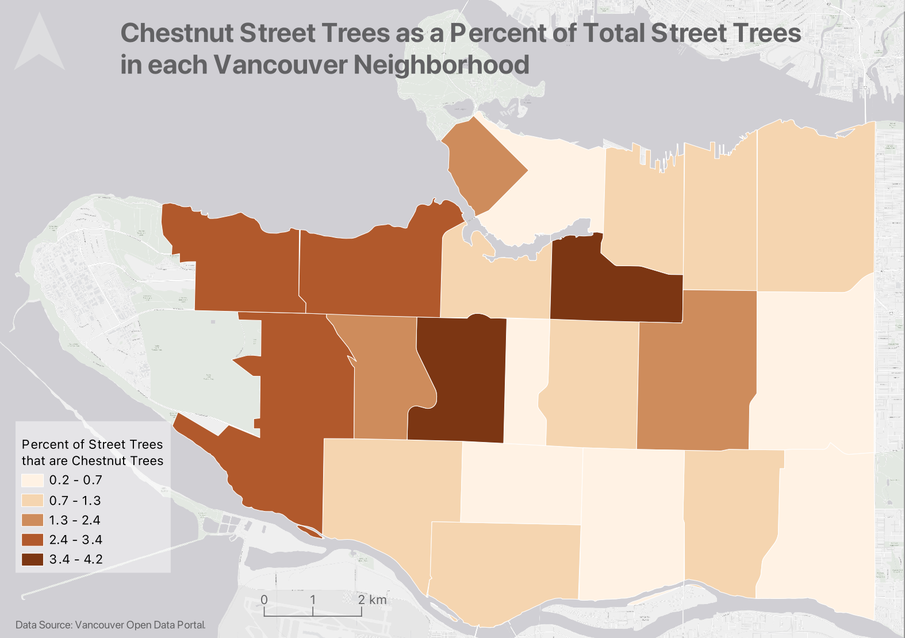
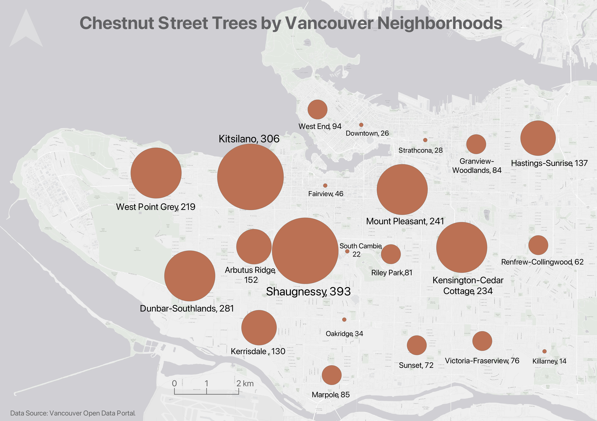
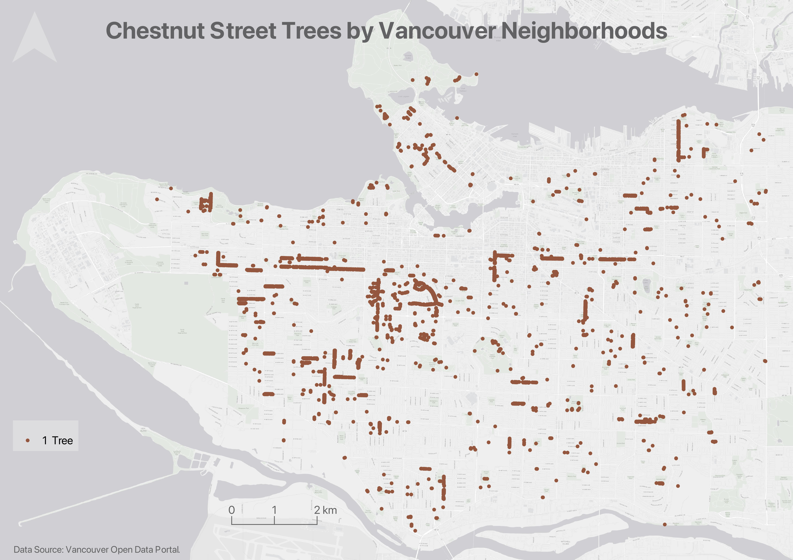
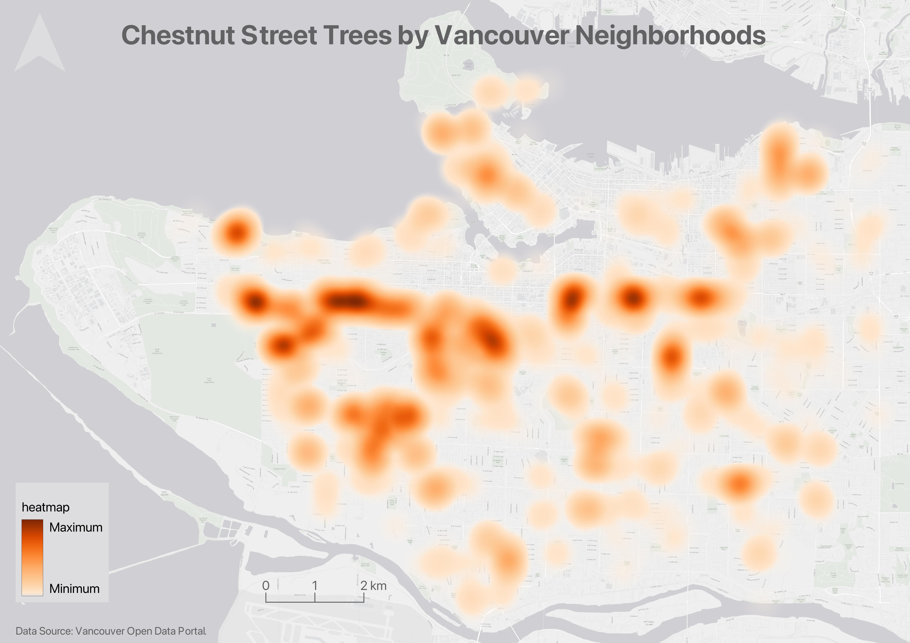
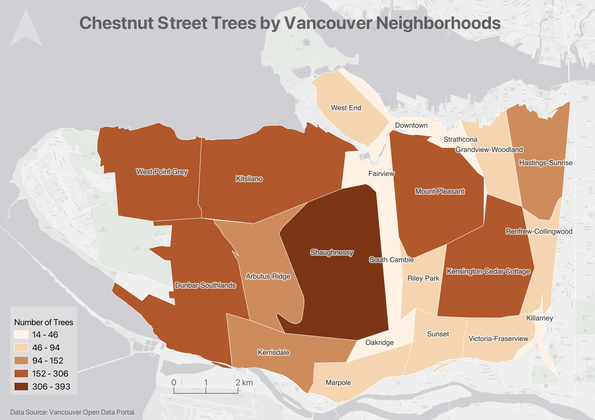

# Thematic Maps

As you learned in the <a href="https://ubc-library-rc.github.io/gis-mapping-intro/" target="_blank">Intro to Mapmaking with QGIS</a>, there are two main kinds of maps: **reference maps** and **thematic maps**. While reference maps are contextual, providing a 'lay of the land' as it were, thematic maps visualize the results of some kind of spatial analysis.
<!-- 
 Spatial analysis involves xyz to answer spatial questions, and is generally carried out inside a Geographic Information System. A Geographic Information System, or GIS, enables you to analyze and manipulate spatial data inside a graphical user interface.  -->

 Writes Statistics Canada: “A thematic map shows the spatial distribution of one or more specific data themes for standard geographic areas.” Thematic maps render the results of spatial anlaysis. [QGIS](https://docs.qgis.org/2.18/en/docs/gentle_gis_introduction/spatial_analysis_interpolation.html#:~:text=Overview,Geographic%20Information%20System%20(GIS).) defines **spatial analysis** as:

> the process of manipulating spatial information to extract new information and meaning from the original data. Usually spatial analysis is carried out with a Geographic Information System (GIS). A GIS usually provides spatial analysis tools for calculating feature statistics and carrying out geoprocessing activities such as data interpolation.

Below are examples of different thematic maps, all visualizing chestnut street trees by Vancouver neighborhoods. While today's workshop focuses on making simple static *reference maps* for academic publication, the additional optional content under Hands-On contains documentation for making each kind of thematic map below.

## Choropleth maps
Choropleth maps are useful to show and compare the density, frequency, or quantity of a value generalized across standardized geographic areas (such as zip-codes, provinces, or countries). Unless you specifically want to emphasize differences in total number of events/data points, it is best practice to normalize your data when choropleth mapping. Normalization is when you divide the values for each geographic area by something like the area in square kilometers or total population of that area. For instance, mapping winter flu cases across census tracts in British Columbia, you'd want to normalize the total cases in each census tract by that tract's total population. Normalization enables better comparison across multiple geographic areas. 

The map below shows total chestnut street trees per Vancouver neighborhood. 

The map below shows chestnut street trees as a fraction of total street trees per Vancouver neighborhood. 

Each map serves a purpose. It's simply important to consider what information you want to convey with your map. 

---- 

## Proportional Symbol maps
Proportional symbol maps are useful to visualize the quantity of something across respective locations. Choropleth maps use a color gradient to convey value differentials, whereas proportional symbol maps use symbol size. Proportional symbols are quite intuitive, and can be combined with other parameters like color and lettering size to provide rich spatial information. Proportional symbols can even be layered atop a choropleth map. See [Axis Maps](https://www.axismaps.com/guide/proportional-symbols) for a guide to proportional symbol maps. 

Note: In most cases you *do not* normalize values when using proportional symbols, as that would reduce the range in difference. If anything, it can be useful to exaggerate the range slightly. While Absolute Scaling renders symbols increasingly larger along a linear scale, Perceptual/Apparent Scaling compensates for the eye's tendency to reduce difference in sizes close together. [See here for more](https://makingmaps.net/2007/08/28/perceptual-scaling-of-map-symbols/). 

<!-- https://schoolofcities.github.io/urban-data-storytelling/urban-data-visualization/proportional-symbol-maps/proportional-symbol-maps.html -->

---- 

## Dot Density maps
Dot density maps are useful to show the concentration and distribution of discrete incidents. Each dot can represent an event (e.g., an earthquake), or a multiple such as 10. For more see [Axis Maps](https://www.axismaps.com/guide/dot-density). Dot Density maps can over-simplify. 

----

## Heatmaps
Useful to show intensity or frequency of occurrence. Heatmaps can be thought about as generalized dot density maps. 

See [here](https://ubc-library-rc.github.io/gis-reference-mapping/content/hands-on13.html) for a short tutorial on making heatmaps with QGIS. 

---

## Cartograms 
Cartograms distort area to emphasize the value associated with a geographic region. When using cartograms, it's important to consider whether your audience is already familiar with the un-distorted  geography, otherwise they might not glean the added information. 

See [here](https://ubc-library-rc.github.io/gis-reference-mapping/content/hands-on14.html) for a short tutorial on making cartograms with QGIS.

----

There is a case to be made that all maps are thematic, as the definition of boundaries, borders, names, etc. is a political - and almost always contested - act. In other words, there are no neutral maps that simply, impartially, represent an objective reality or truth. See [Crampton and Krygier (2006)](https://acme-journal.org/index.php/acme/article/view/723) or [Harley 1992 (1992)](https://quod.lib.umich.edu/p/passages/4761530.0003.008/--deconstructing-the-map?rgn=main;view=fulltext) for a seminal introduction to critical cartography, or [Wang and Liu (2022)](https://www.researchgate.net/publication/365011390_Maps_and_cartography_Progress_in_international_critical_cartographyGIS_research) for an overview of critical cartography and GIS through the last several decades. See also the classic by Denis Wood, *The Power of Maps*.
{: .note}

----
#### Resources

If you have spatial questions you want to explore with your data, you’ll likely need to perform some kind of spatial analysis within a GIS. Check out [Map Production with QGIS](https://ubc-library-rc.github.io/gis-intro-qgis/), [Thematic mapping with QGIS](https://ubc-library-rc.github.io/gis-thematic-mapping/), and [Tools and Workflows in QGIS](https://ubc-library-rc.github.io/gis-tools-workflows/) for more on data modification, spatial selections, attribute table calculations, and geoprocessing. If you are still designing your project and unsure as to your output, check out the Research Common's [Designing Spatial Stories](https://ubc-library-rc.github.io/gis-spatial-stories/) workshop, email the Geospatial team at `library.gis@ubc.ca`, or [book a consult](https://libcal.library.ubc.ca/appointments/research_commons#s-lc-public-pt).

