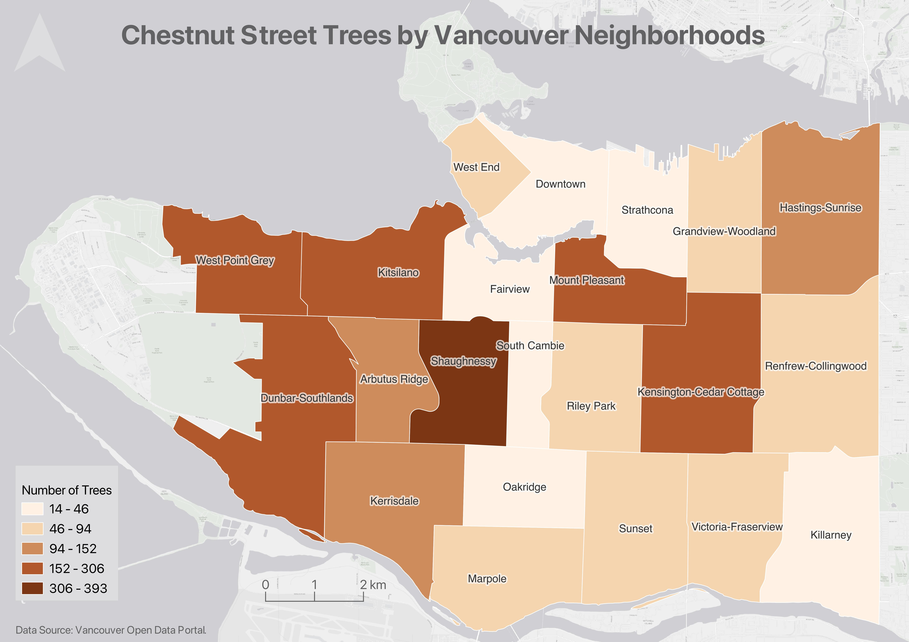

# Thematic Mapping with QGIS

This intermediate-level workshop will demonstrate how to create thematic maps using QGIS, a free and open-source Geographic Information System (GIS) for analyzing, modifying, and visualizing spatial data. Additionally, participants will learn how to perform queries on spatial data and edit the attribute table.

The result of this workshop will be a choropleth map showing the number of chestnut trees lining the streets in each of Vancouver’s neighbourhoods. By the end of the workshop participants will be able to:

- query data from the attribute table
- create and export selections
- edit a shapefile 
- change the the symbolization of spatial data
- create different kinds of thematic maps, 
- compose a map document for export

The final map you will create will look something like this:

---
## Before the Workshop!!

1. **Review our Introduction to Mapmaking with QGIS** Please note that the fundamental skills and concepts pertaining to spatial data, map types, and the QGIS interface will *not be* covered during this workshop. Therefore, prior to the workshop date, please review our *[Introduction to Mapmaking with QGIS](https://ubc-library-rc.github.io/gis-mapping-intro/)*. **Review of this resources *is required* prior to workshop attendance.** 

2. **Make sure you've downloaded QGIS** QGIS can be downloaded from [qgis.org's Downloads page](https://qgis.org/en/site/forusers/download.html). In most cases, you'll want to download and install the **Long term release** instead of the latest release. This will give you most of the functionality you'll need without encountering the software bugs of newly released versions. See this page <a href="[./installing-qgis.html](https://ubc-library-rc.github.io/gis-mapping-intro/content/gis-overview.html)" target="_blank"><b>Installing QGIS</b></a> for further guidance. 

2.  **Download and unzip the workshop data folder** below. Download it to a folder on your physical computer, such as Desktop or Downloads, _not_ OneDrive.

[Download Workshop Data](./thematic-mapping-workshop.zip){: .btn .btn-blue }

 

#### GIS Resources at UBC:
<!-- - General Informational website for all things UBC GIS: [gis.ubc.ca](http://gis.ubc.ca/) -->
- UBC Library guide for finding and working with GIS resources: [guides.library.ubc.ca/gis](http://guides.library.ubc.ca/gis)
- Archive of [Research Commons workshops](https://ubc-library-rc.github.io/)
- Research Commons [Events Calender](https://researchcommons.library.ubc.ca/events/) for upcoming facilitated workshops
- Contact UBC Library’s Geospatial team: `library.gis@ubc.ca`
- Schedule a 1:1 consult with the geospatial team [here](https://libcal.library.ubc.ca/appointments/research_commons#s-lc-public-pt)

This workshop was authored by <a href="https://geog.ubc.ca/profile/lily-crandall-oral/" target="_blank">Lily Demet</a> and reviewed by Alex Alisauskas.

