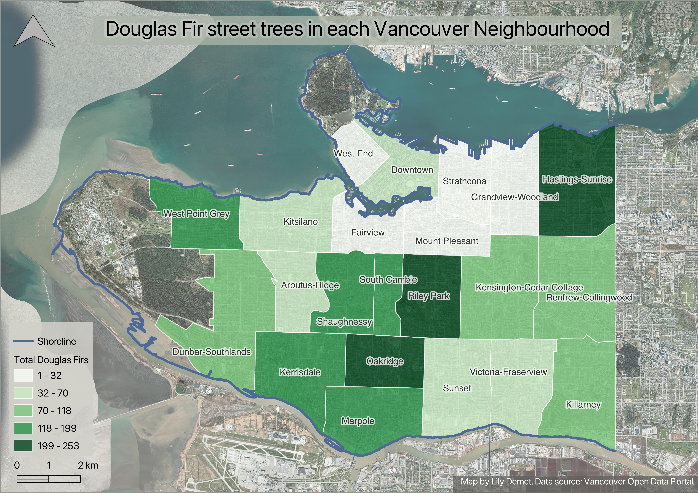

# Thematic Mapping with QGIS

This intermediate-level workshop will demonstrate how to create thematic maps using [QGIS](https://qgis.org/){:target="_blank"}, a free and open-source Geographic Information System (GIS) for analyzing, modifying, and visualizing spatial data. While previous workshops on [GIS 101](https://ubc-library-rc.github.io/gis-mapping-intro/){:target="_blank"} and [Reference Mapping with QGIS](https://ubc-library-rc.github.io/gis-reference-mapping/){:target="_blank"} have honed the fundamental skills and knowledge to begin using GIS, this workshop will focus on data visualization. 

By the end of this workshop, you will have the confidence to 
- Explore a dataset's attribute table;
- Build queries to run selections on your dataset;
- Evaluate the advantages of various thematic mapping techniques; and
- Apply this knowledge to create both a choropleth map and a proportional symbol map to visualize the number of douglas fir street trees in each Vancouver neighbourhood. 

<!-- 
 "common_name"  =  'DOUGLAS FIR' or  ("common_name"  =   'BLACK POPLAR'  and  "height_m"  >=  30 ) or  ("common_name"  =   'BLACK COTTONWOOD' and "height_m"  >=  30) or ("common_name"  =  'GIANT SEQUOIA' and  "height_m"  >=  30 ) or ("common_name"  =  'BIGLEAF MAPLE' and  "height_m"  >=  30 ) or ( "common_name"  =  'WESTERN RED CEDAR' and "height_m"  >=  30) -->

The final map you will create will look something like this:

---
## Before the Workshop!!

1. **Review our Introduction to Mapmaking with QGIS** Please note that the fundamental skills and concepts pertaining to spatial data, map types, and the QGIS interface will *not be* covered during this workshop. Therefore, prior to the workshop date, please review our *[Introduction to Mapmaking with QGIS](https://ubc-library-rc.github.io/gis-mapping-intro/){:target="_blank"}*. **Review of this resources *is required* prior to workshop attendance.** 

2. **Make sure you've downloaded QGIS** QGIS can be downloaded from [qgis.org's Downloads page](https://qgis.org/en/site/forusers/download.html){:target="_blank"}. In most cases, you'll want to download and install the **Long term release** instead of the latest release. This will give you most of the functionality you'll need without encountering the software bugs of newly released versions. See <a href="https://ubc-library-rc.github.io/gis-dhsi/software-download.html" target="_blank"><b>here</b></a> for further guidance on installing QGIS. 

2.  **Download and unzip the workshop data folder** below. Download it to a location on your physical computer, such as Desktop or Downloads, _not_ OneDrive.

[Download Workshop Data](./thematic-mapping-workshop.zip){: .btn .btn-blue }

 

#### GIS Resources at UBC:
<!-- - General Informational website for all things UBC GIS: [gis.ubc.ca](http://gis.ubc.ca/){:target="_blank"} -->
- UBC Library guide for finding and working with GIS resources: [guides.library.ubc.ca/gis](http://guides.library.ubc.ca/gis){:target="_blank"}
- Archive of [Research Commons workshops](https://ubc-library-rc.github.io/){:target="_blank"}
- Research Commons [Events Calender](https://researchcommons.library.ubc.ca/events/){:target="_blank"} for upcoming facilitated workshops
- Contact UBC Library’s Geospatial team: `library.gis@ubc.ca`
- Schedule a 1:1 consult with the geospatial team [here](https://libcal.library.ubc.ca/appointments/research_commons#s-lc-public-pt){:target="_blank"}
- For a more comprehensive introduction to mapping, you are welcome to explore the content of [Spatial Visualization in/for Digital Humanities Research](https://ubc-library-rc.github.io/gis-dhsi/){:target="_blank"}, a course developed and taught by Lily Demet and Alex Alisauskas at the 2026 Digital Humanities Summer Institute. Here, you will find comprehensive documentation (and practice data) for all kinds of mapping tools and workflows. 

This workshop was authored by <a href="https://geog.ubc.ca/profile/lily-crandall-oral/" target="_blank">Lily Demet</a> and reviewed by Alex Alisauskas.

